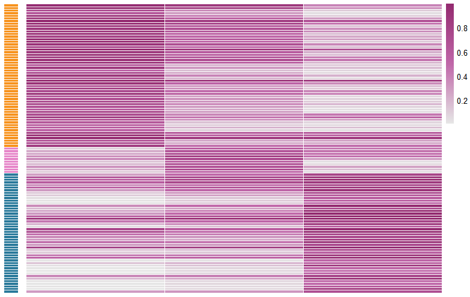
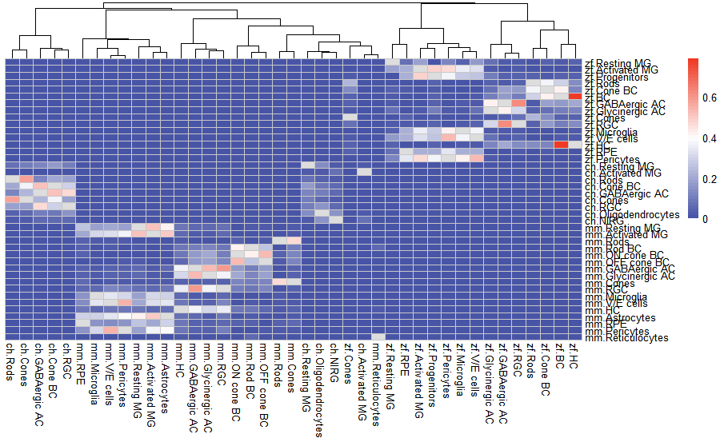

<!-- README.md is generated from README.Rmd. Please edit that file -->

```{r, include = FALSE}
knitr::opts_chunk$set(
  collapse = TRUE,
  comment = "#>",
  fig.path = "man/figures/README-",
  out.width = "100%"
)
```

# CACIMAR

<!-- badges: start -->
<!-- badges: end -->

CACIMAR is an R package to identify cross-species marker genes, cell types and gene regulatory networks based on scRNA-seq data.

## Installation

Install CACIMAR from github, run:

``` r
# install.packages("devtools")
devtools::install_github("jiang-junyao/CACIMAR")
```
## Inputs data
### (1) Seurat object
Seurat object should have clustering information in active.ident slot and meta.data slot

### (2) Marker genes table (used for identifying cell types)
Rownames of Marker genes table should be the same format as the rownames format of seurat object, and should contain CellType column (Marker genes table can also contain other columns, which will not affect this function)

## Tutorial

### 1.Identify Cell types
Using known marker genes to annotate each cluster. This method is based on AUC (area under the receiver operating characteristic curve of gene expression), and is very sensitive to the marker genes input.

```{r warning=F,message=F}
library(CACIMAR)
Marker <- read.table('D:\\GIBH\\platform\\test data/Retinal_markersZf.txt',header = T)
head(Marker)
```
```r
### I identify cell type for 3 clusters here to reduce the running time
seurat_object <- readRDS('D:\\GIBH\\platform\\test data/Zebrafishdata.rds')
seurat_object <- subset(seurat_object,idents = c(1,2,3))
zfcelltype <- Identify_CellType(seurat_object,Marker)
```

### 2.Identify markers
In this part, CACIMAR first uses ROC analysis in 'FindAllMarkers' function of [Seurat](https://satijalab.org/seurat/articles/get_started.html) to identify marker genes in each cluster. Then, based on marker genes identified above, CACIMAR calculates the power of marker gene in each and differences of marker gene between clusters, and marker genes with high differences between clusters will be retained. Finally, CACIMAR uses fisher test to identify significant cluster related to this marker gene (p.value <0.05).
```r
Marker1 <- Identify_Markers(seurat_object)
```
plot Marker genes with Heaptmap
```
Plot_MarkersHeatmap(Marker1)
```



### 3.Identify cross-species marker genes
#### Identify cross-species marker genes in two species 
In this part, CACIMAR first uses **ortholog genes database of two species** to refine marker genes, marker genes in orthologs database will be retained. Then, CACIMAR selects marker genes that are in the same cell type of two species as cross-species marker genes of two species.
```{r message=FALSE}
###Get_Used_OrthG
Mm_marker_cell_type <- read.delim2("D:/GIBH/platform/test data/Mm_marker_cell_type.txt")
head(Mm_marker_cell_type)###This table must contain 'CellType' column
Zf_marker_cell_type <- read.delim2("D:/GIBH/platform/test data/Zf_marker_cell_type.txt")
Ch_marker_cell_type <- read.delim2("D:/GIBH/platform/test data/Ch_marker_cell_type.txt")
###select orthologs genes database
OrthgMmZf <- OrthG_Mm_Zf
OrthgZfCh <- OrthG_Zf_Ch
###identify orthologs marker genes
OrthG_TwoSpecies1 <- OrthG_TwoSpecies(OrthgMmZf,Mm_marker_cell_type,Zf_marker_cell_type,Species_name1 = 'mm',Species_name2 = 'zf')
OrthG_TwoSpecies2 <- OrthG_TwoSpecies(OrthgZfCh,Ch_marker_cell_type,Zf_marker_cell_type,Species_name1 = 'ch',Species_name2 = 'zf')
```
#### Identify cross-species marker genes in three species 
Identify orthologs genes for three species based on the result of OrthG_Twospecies
```{r message=F}
OrthG_ThreeSpecies<-OrthG_ThreeSpecies(OrthG_TwoSpecies1,OrthG_TwoSpecies2,c('mm','zf','zf','ch'))
```
Unkown codes
```r
###usage???
###Get_Wilcox_Markers_Cond ###???usage???
wilcox<-read.table('D:\\GIBH\\platform\\test data/mmP60RmmNMDA_mmP60mmLD_wilcoxMG_MarkerGenes.txt')
Cor<-read.table('D:\\GIBH\\platform\\test data/mmP60RmmNMDA_mmLD_pbmcSubC_MG_Bin50_R5_GeneCor.txt',header = T)
wilcox_result<-get_Wilcox_Markers_Cond(wilcox,Cor)
###Overlap_Markers_Cond
mmMarkers3_F3F0 <- read.delim("D:/GIBH/platform/test data/mmP60RmmNMDA_mmP60mmLD_P03_Markers3_F3F0.txt")
zfMarkers3_F3F0 <- read.delim("D:/GIBH/platform/test data/zfAdzfNMDA_zfAdzfLD_zfAdzfTR_P03_Markers3_F3F0.txt")
mmCelltype<-read.table('D:/GIBH/platform/test data/mmP60RmmNMDA_mmP60mmLD_Cell_Types.txt',header = T)
zfCelltype<-read.table('D:/GIBH/platform/test data/zfAdzfNMDA_zfAdzfLD_zfAdzfTR_Cell_Types.txt',header = T)
mmMarker<-Overlap_Markers_Cond(mmMarkers3_F3F0,mmCelltype,Spec1='mm')
zfMarker<-Overlap_Markers_Cond(zfMarkers3_F3F0,zfCelltype,Spec1='zf')
```

### 4.Cross-species celltype heamtmap
```r
zfAdzfNMDA_pbmcSubC_CondSub_P0_Markers1 <- read.delim("D:/GIBH/platform/test data/cell type/zfAdzfNMDA_pbmcSubC_CondSub_P0_Markers1.txt")
chP10chNMDA_UMI500_chFI48chNMDA72_sSubCM_P0_Markers1 <- read.delim("D:/GIBH/platform/test data/cell type/chP10chNMDA_UMI500_chFI48chNMDA72_sSubCM_P0_Markers1.txt")
mmP60RmmNMDA_pbmcSubC_P0_Markers1 <- read.delim("D:/GIBH/platform/test data/cell type/mmP60RmmNMDA_pbmcSubC_P0_Markers1.txt")
Marker_list <- list(zfAdzfNMDA_pbmcSubC_CondSub_P0_Markers1,chP10chNMDA_UMI500_chFI48chNMDA72_sSubCM_P0_Markers1,mmP60RmmNMDA_pbmcSubC_P0_Markers1)
expression <- Identify_SharedMarkers(Marker_list,Species_names=c('zf','ch','mm'))
cell_type_power <- expression[[2]]
celltypes<-read.delim("D:/GIBH/platform/CellType_Comp/CellType_Comp/Data/mmP60RmmNMDA_chP10chNMDA_zfAdzfNMDA_Cell_Types.txt")
a<-Heatmap_Cor(cell_type_power,celltypes,cluster_cols=T, cluster_rows=F)
Plot_tree(a)
```

###5. Cross-species regulatory networks
