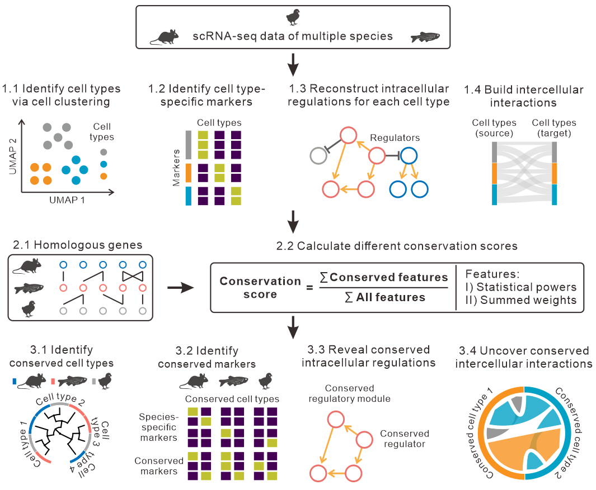

<!-- README.md is generated from README.Rmd. Please edit that file -->

```{r, include = FALSE}
knitr::opts_chunk$set(
  collapse = TRUE,
  comment = "#>",
  fig.path = "man/figures/README-",
  out.width = "100%"
)
```

# CACIMAR: cross-species analysis of cell identities, markers and regulations using single-cell sequencing profiles

<!-- badges: start -->
<!-- badges: end -->

* **Identify cell types using known markers in each species**

* **Identify all cell-type specific markers in each species**

* **Identify species-specific or evolutionally conserved markers**

* **Identify cross-species cell types using evolutionally conserved markers**

* **Comparative analysis of regulatory networks in evolutionally conserved cell types**





## Installation

Install CACIMAR from github, run:

``` r
# install.packages("devtools")
devtools::install_github("jiang-junyao/CACIMAR")
```

## Citation
[Hoang T, Wang J, Boyd P, et al. Gene regulatory networks controlling vertebrate retinal regeneration. Science 2020; 370(6519):eabb8598](https://www.science.org/doi/10.1126/science.abb8598)

## Tutorial

[Cross-species marker genes and cell types analysis of retina](https://jiang-junyao.github.io/CACIMAR/CACIMAR_tutorial)
