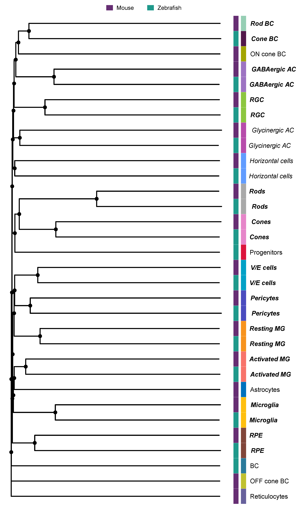
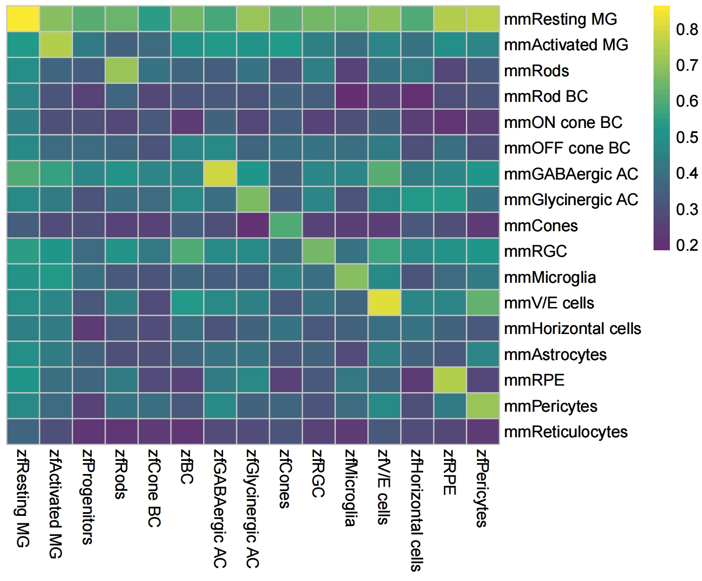
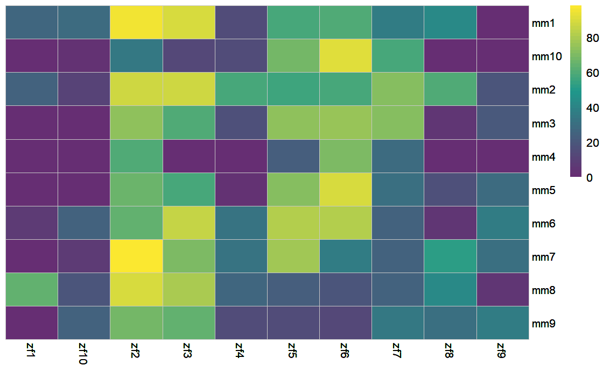
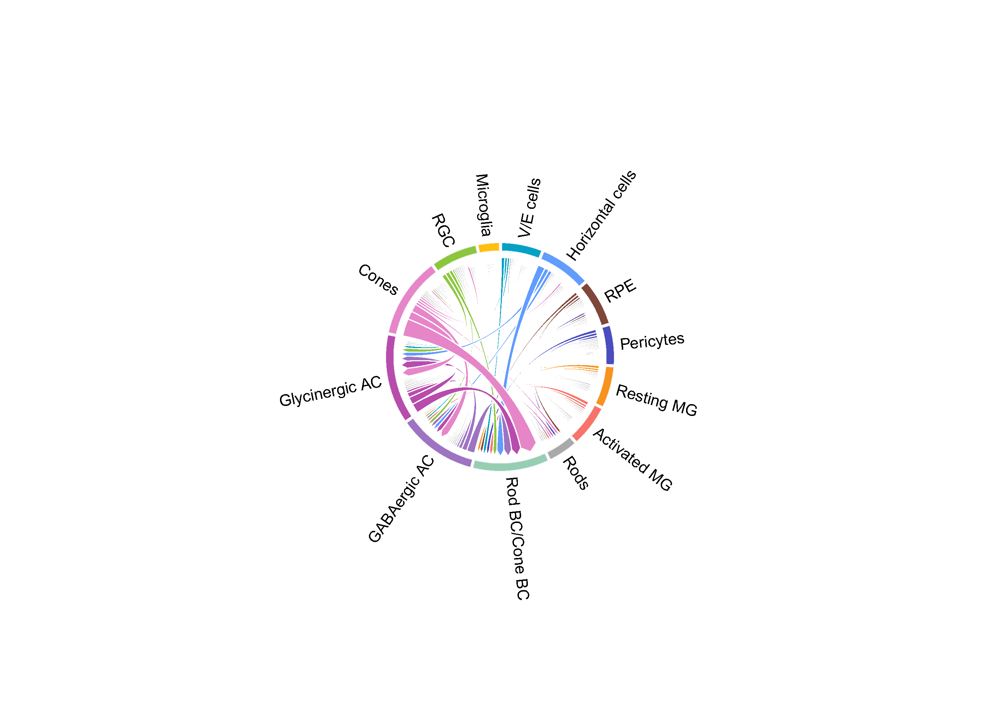
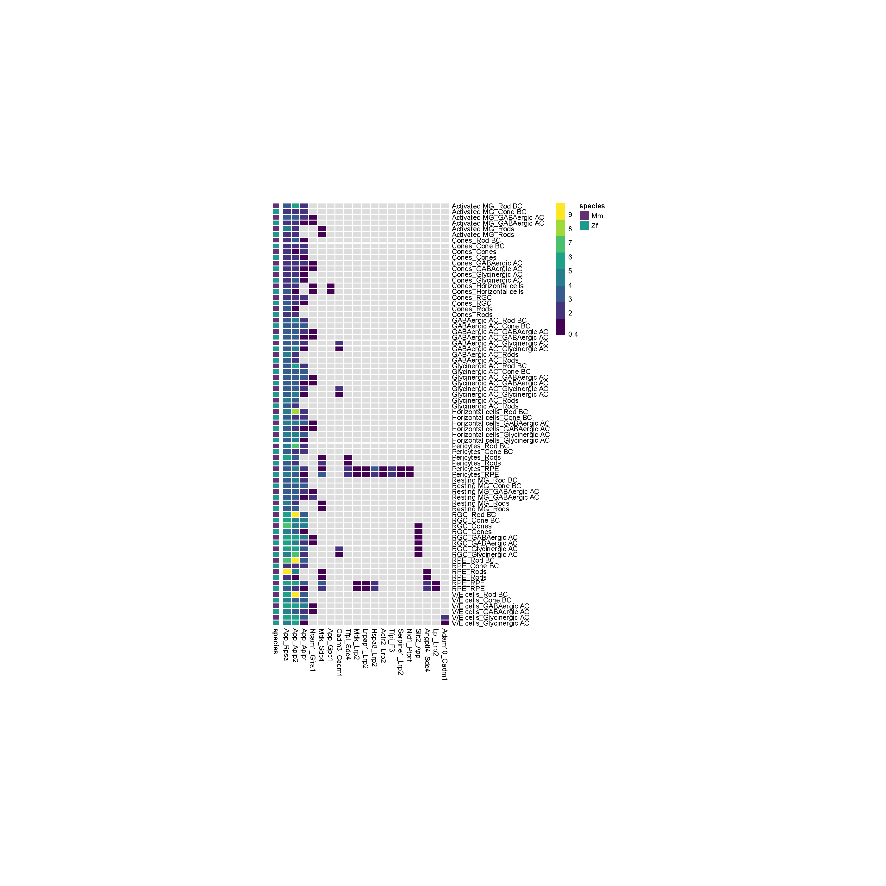

<style>
  body {
  font-family: "Helvetica";
    font-size: 16px;
    color: black;
  }
</style>

```{r setup, include=FALSE}
## Global options
knitr::opts_chunk$set(cache = TRUE)
library(CACIMAR)
```

# Installation

Follow the steps below to install CACIMAR package from GitHub and run it:

``` r
# install
# install.packages("devtools") # Install devtools if not already installed
devtools::install_github("jiang-junyao/CACIMAR")
# require
library(CACIMAR)
library(reshape2)
```

# Introduction

In this tutorial, we analyze retina regeneration scRNA-seq data from mouse and zebrafish to identify conserved markers, cell types, intracellular regulations and intercellular interactions in the retina between mice and zebrafish. This tutorial contains following 5 steps: (1) Identify markers; (2) Identify evolutionarily conserved cell types; (3) Identify evolutionarily conserved markers; (4) Identify conserved intracellular regulation; (5) Identify conserved intercellular interactions (cell-cell interaction)

# Tutorial

In this tutorial, we analyze retina regeneration scRNA-seq data from mouse and zebrafish to identify conserved markers, cell types, intracellular regulations and intercellular interactions in the retina between mice and zebrafish. This tutorial contains following 5 steps: 

## Input data of this tutorial

### Seurat object of mouse and zebrafish

Seurat object should include cell types information in the ‘active.ident’ slot. Test data can be download from [Google drive](https://drive.google.com/drive/folders/15bqQmEH4cDFRiEHYZTEp4gYWK4FJAhBL?usp=sharing)

### Homologous gene database

A homologous gene database is required. CACIMAR has already generated a homologous gene database for human, mouse, zebrafish, and chicken. You can use the following code to load the pre-built database, or you can generate your own homologous gene database using the instructions provided in the “Build homologous gene database” section of the tutorial. To load the pre-built database:
```{r}
### load homologous gene database of human and mouse
OrthG <- OrthG_Hs_Mm
### load homologous gene database of human and chicken
OrthG <- OrthG_Hs_Ch
### load homologous gene database of human and zebrafish
OrthG <- OrthG_Hs_Zf
### load homologous gene database of mouse and chicken
OrthG <- OrthG_Mm_Ch
### load homologous gene database of mouse and zebrafish
OrthG <- OrthG_Mm_Zf
### load homologous gene database of zebrafish and chicken
OrthG <- OrthG_Zf_Ch
```

### Gene regulatory network (for step4)

Using the following code to load cell type specific networks

```r
load(system.file("extdata", "gene_network.rda", package = "CACIMAR"))
```

Using the following code to load modularized regulatory networks


## Step1: Identify markers
  In this part, CACIMAR first used receiver operating characteristic (ROC) based method in 'FindAllMarkers' function of [Seurat](https://satijalab.org/seurat/articles/get_started.html) to identify markers in each cluster for every species individually. Then, based on marker genes identified above, CACIMAR calculates the power of markers(MP, MP= 2 × abs(AUC-0.5)) in each cluster and the expression differences of markers(logFC) between clusters. Markers with MP > 0.35 and logFC > 0.1 will be retained. 

```r
### identify markers
Zf_seurat <- readRDS('Zf_seurat.rds')
Mm_seurat <- readRDS('Mm_seurat.rds')
zf_marker <- Identify_Markers(Zf_seurat,PowerCutoff=0.35, DifferenceCutoff=0.1)
mm_marker <- Identify_Markers(Mm_seurat,PowerCutoff=0.35, DifferenceCutoff=0.1)
```

## Step2:Identify evolutionarily conserved cell types
   CACIMAR identifies evolutionarily conserved cell types and poorly conserved cell types utilizing conservation scores of cell types (CSCT) and a phylogenetic tree. 
  
  CSCT is computed based on the powers (or MP values) of shared markers in each pair of cell types, relative to the sum of the powers of all markers in each pair of cell types. Shared markers indicate the markers of one species that have homologs in the other species. If genes have multiple homologs, the gene with the highest power is selected. If the pair of cell types is mutually matched, and CSCT is greater than the third quartile of CSCT values, then this pair of cell types is considered a conserved cell type between two species. Mutually matched pair cell types mean that for every cell type in species 1, we look for the corresponding cell type in species 2 that has the highest CSCT value, and vice versa. The corresponding cell types in both species are said to be “mutually matched,” and they have the highest CSCT value relative to all other cell types in the other species.
  
  Besides, we generate a phylogenetic tree based on the CSCT value using the hierarchical clustering method UPGMA (unweighted pair group method using arithmetic mean) to further identify the conserved cell types and the poorly conserved cell types. If cell types from two species are from the same clade of bipartition, the two cell types are considered conserved cell types across species. However, if these conserved cell types are only identified by the phylogenetic tree of cell types, they are regarded as poorly conserved cell types.

If you haven't run step1, you can just use the following code to get input data
```{r}
load(system.file("extdata", "zf_mm_markers.rda", package = "CACIMAR"))
```

```{r}
### identify evolutionarily conserved cell types based on conservation score of cell types (CSCT)
OrthG <- OrthG_Mm_Zf
expression <- Identify_ConservedCellTypes(OrthG, zf_marker, mm_marker,'zf','mm')
SCT_matrix <- expression[[2]]
SNT_h <- expression[[2]][grep('mm',rownames(SCT_matrix)),as.numeric(grep('zf',colnames(SCT_matrix)))]
### show the CSCT value with a heatmap
Heatmap_Cor(SNT_h,cluster_cols=F, cluster_rows=F,Color1 = c(rgb(102/255,46/255,115/255),rgb(31/255,153/255,139/255),rgb(251/255,232/255,48/255)))
```

Then, we identify conserved cell type based on the CSCT.
```{r}
conserved_celltypes = identify_conserved_pair(SNT_h)
print(conserved_celltypes)
```


Then we can evaluate evolutionarily conserved cell types and poorly conserved cell types through phylogenetic tree. By default, distinct fonts are employed for tip labels to indicate the evolutionary conservation status of cell types. This allows for differentiation between evolutionarily conserved cell types(bold.italic), poorly conserved cell types(italic), and unconserved cell types(plain). To customize the colors for the tip labels, you can utilize the tiplab_cols parameter and specify the desired color scheme. The default color scheme assigns dark blue to represent evolutionarily conserved cell types, light blue to represent poorly conserved cell types, and grey to represent unconserved cell types. Additionally, if you wish to change the method used for constructing the phylogenetic tree, you can modify the tree_method parameter to "classic Neighbor-Joining" method.

```r
### get the conserved cell types based on the mutually matched and bigger than 3/4 CSCT score
conserved_hm_celltypes <- get_conserved_hm_celltypes(SNT_h)
### used my pointed colors
load(system.file("extdata", "bind_colors.rda", package = "CACIMAR"))
### generate a phylogenetic tree
species.vector <- substr(rownames(SCT_matrix), 1, 2)
p <- Plot_phylogenetic_tree(SCT_matrix = SCT_matrix,
                            species.vector = species.vector, 
                            conserved_hm_celltype = conserved_hm_celltypes,
                            annotation_colors_df = bind_colors,
                            colors_labels = c("Mouse", "Zebrafish")) 
```




## Step3:Identify evolutionarily conserved markers
  CACIMAR initially employs a **homologous gene database** to enhance the markers identified by the "FindAllMarkers" function using ROC. Markers that are present in the homologous database are then considered as shared markers. Subsequently, CACIMAR identifies markers present in the conserved cell types from step2 and retains them as evolutionarily conserved markers.


```{r}
load(system.file("extdata", "zf_mm_markers.rda", package = "CACIMAR"))
```

```{r message=FALSE,warning=FALSE}
conserved_markers = Identify_ConservedMarkers(OrthG_Mm_Zf,mm_marker,zf_marker,
                                              'mm','zf',conserved_celltypes)
```

### Plot conserved markers
```{r}
mm_conserved_markers = mm_marker[conserved_markers$mmgene,6:22]
mm_conserved_markers = cbind(conserved_markers$mmcluster,mm_conserved_markers)
zf_conserved_markers = zf_marker[conserved_markers$zfgene,6:20]
zf_conserved_markers = cbind(conserved_markers$zfcluster,zf_conserved_markers)
zf_conserved_markers = zf_conserved_markers[order(zf_conserved_markers[,1]),]
### plot mouse conserved markers
Plot_MarkersHeatmap(mm_conserved_markers,cellheight = 1,cellwidth = 6,
                    legend = T)
### plot zebrafish conserved markers
Plot_MarkersHeatmap(zf_conserved_markers,cellheight = 1,cellwidth = 6,
                    legend = T)
```


## Step4: Identify conserved intracellular regulation
  We employed CACIMAR to assess the evolutionary conservation of two separate regulatory networks: cell type-specific regulatory networks and regulatory subnetworks, otherwise known as modules, across various species. CACIMAR calculates the conservation score of regulatory networks (CSRN) for different cell types/modules in regulatory networks of distinct species. CSRN is computed based on two criteria: (I) the proportion of homologous genes (nodes) compared to all genes, and (II) the proportion of interactions (edges) among homologous genes compared to all interactions. A higher CSRN indicates a more conserved regulatory network. 
  
### Assess the evolutionary conservation of cell type-specific regulatory networks

  The following cell type specific regulatory networks are constructed by [IReNA](https://github.com/jiang-junyao/IReNA), which can integrate scRNA-seq and scATAC-seq/ATAC-seq data or use scRNA-seq/RNA-seq data alone to construct modularized regulatory networks. You can use the following codes to load test networks.

```r
load(system.file("extdata", "gene_network.rda", package = "CACIMAR"))
```

```{r warning=FALSE,message=FALSE, eval=FALSE}
ConservedNetworks_ct <- identify_ct_ConservedNetworks(OrthG, Species1_GRN, Species2_GRN, 'mm', 'zf')
Heatmap_Cor(ConservedNetworks_ct[[2]], cluster_cols=F, cluster_rows=F, Color1 = c(rgb(102/255,46/255,115/255), rgb(31/255,153/255,139/255), rgb(251/255,232/255,48/255)))
```



### Assess the evolutionary conservation of Modularized regulatory networks
  Modular regulatory networks used here are constructed by R package [IReNA](https://github.com/jiang-junyao/IReNA), which can integrate scRNA-seq and scATAC-seq/ATAC-seq data or use scRNA-seq/RNA-seq data alone to construct modularized regulatory networks. [WGCNA](https://horvath.genetics.ucla.edu/html/CoexpressionNetwork/Rpackages/WGCNA/) is an optional method that can generate the input. However, WGCNA only can construct regulatory networks through bulk RNA-seq data.

```{r warning=FALSE,message=FALSE, eval=FALSE}
ConservedNetworks <- Identify_ConservedNetworks(OrthG, mm_gene_network, zf_gene_network, 'mm', 'zf')
Heatmap_Cor(ConservedNetworks[[2]], cluster_cols=F, cluster_rows=F, Color1 = c(rgb(102/255,46/255,115/255), rgb(31/255,153/255,139/255), rgb(251/255,232/255,48/255)))
```



## Step5:Identify conserved intercellular interactions (cell-cell interaction)
  CACIMAR employs the SingleCellSignalR algorithm from [liana](https://saezlab.github.io/liana/) to identify evolutionarily conserved cell-cell interactions (CCI) based on the expression levels of ligands and receptors. CCI that satisfy the following criteria are regarded as evolutionarily conserved: (I) the interactions between ligands and receptors demonstrate consistency, and (II) the cell type of the ligand and receptor in species 1 should correspond to the cell type of the ligand and receptor in species 2, respectively. Subsequently, we compute the proportion of consistent intercellular interactions to gauge the conservation score for intercellular interactions (CSII).

### Perform cell-cell interaction analysis with SingleCellSignalR algorithm 
```{r, eval=FALSE}
# By default, we contained the interactions that have a LRscore greater than 0.5 and scale the LRscore
SingleCellSignalR_mouse_result <- perform_CCI_analysis(seurat_obj=Mm_seurat, target_organism=10090)
SingleCellSignalR_zebrafish_result <- perform_CCI_analysis(seurat_obj=Zf_seurat, target_organism=7955)
```

### Overall cell-cell interactions profile across two species
  Here, we summarize the weight of all interactions within each pair of cell types and display the profile with a sankey plot. The left side represents the source of ligands in mouse, the right side represents the source of ligands in zebrafish, and the middle represents all the target receptors shared by both species.

``` {r, eval=FALSE}
load(system.file("extdata", "SingleCellSignalR_results.rda", package = "CACIMAR"))
```

```{r, eval=FALSE}
# sum Weights of each cell types
all_weight_df_long_Mm_zf <- calculate_Weights(species1_cci = SingleCellSignalR_mouse_result,
                                              species2_cci = SingleCellSignalR_zebrafish_result,
                                              specie_name1 = "mm",
                                              specie_name2 = "zf")

# sankey plot will be saved in current directory by default
# If the colors_file is set to NULL, the colors will be automatically assigned.
create_sankey(links = all_weight_df_long_Mm_zf[, c("Source2", "target", "scale_weight")],
              output_file = "Mm_Zf_sankey.html",
              specie_name1 = "mm",
              specie_name2 = "zf")
```


### Identified the evolutionarily conserved cell-cell interactions (CCI)
If you don't want to run the cell-cell interaction above, you can load test data with ***load(system.file("extdata", "mouse_cci_test.rda", package = "CACIMAR"))*** for this part to caculate the conservation score for intercellular interactions(CSII).

```{r, eval=FALSE}
##### ChordDiagram, two species
## caculate the conservation score for intercellular interactions(CSII)
# mm and zf conserved score of interaction
conserved_cell_types_mm_zf <- data.frame("mm" = c("mmRods", "mmRod BC", "mmCones", "mmPericytes", "mmV/E cells", "mmRGC", "mmGABAergic AC", "mmRPE", "mmResting MG", "mmActivated MG", "mmMicroglia", "mmGlycinergic AC", "mmHorizontal cells"), "zf" = c("zfRods", "zfCone BC", "zfCones", "zfPericytes", "zfV/E cells", "zfRGC", "zfGABAergic AC", "zfRPE", "zfResting MG", "zfActivated MG", "zfMicroglia", "zfGlycinergic AC", "zfHorizontal cells"))
conserved_result_mm_zf <- Identify_Conserved_CCI1(species1_cci=SingleCellSignalR_mouse_result,
                                                 species2_cci=SingleCellSignalR_zebrafish_result,
                                                 conserved_cell_types_df=conserved_cell_types_mm_zf,
                                                 species_name1 = "mm",
                                                 species_name2 = "zf")
cci_conserved_Weights_table_mm_zf <- Caculate_cell_pair_cci_score(conserved_result_df=conserved_result_mm_zf,
                                                                  species1_cci = SingleCellSignalR_mouse_result,
                                                                  species2_cci = SingleCellSignalR_zebrafish_result,
                                                                  conserved_cell_types_df = conserved_cell_types_mm_zf,
                                                                  species_name1 = "mm",
                                                                  species_name2 = "zf")
cci_data_mm_zf <- Make_ChordDiagram_data(cci_conserved_Weights_table = cci_conserved_Weights_table_mm_zf, species_name1 = "mm", species_name2 = "zf")
## ChordDiagram shows the CSII
ChordDiagram(net = cci_data_mm_zf, filename = paste("mm", "zf", "chordDiagram.pdf", sep = "_"))
```



### Show the conserved ligand-receptor pairs 
```{r, eval=FALSE}
# We display the ligand-receptor pairs in the cell type pairs where the CSII is greater than or equal to the third quantile value of CSII by default
merge_avg_width_df <- make_pheatmap_LR_data1(cci_conserved_results = conserved_result_mm_zf,
                                            seurat_object_sp1 = Mm_seurat,
                                            seurat_object_sp2 = Zf_seurat,
                                            avg_group = "cellname",
                                            species_name1 = "mm",
                                            species_name2 = "zf",
                                            cci_conserved_Weights = cci_conserved_Weights_table_mm_zf)
pheatmap_LR1(width_df = merge_avg_width_df$merge_width_df_width, filename = "lr_avg_pheatmap.pdf")
```



# Addtional function: Build homologous gene database
  Under the situation that homologous gene database of your interested species is not included in our package, CACIMAR provides to build your own homologous gene database according to MGI database. 

*Hint* Only github version of CACIMAR supports this part

## (1) Inputs data of this part

- ***MGI database***
  MGI database can be downloaded from http://www.informatics.jax.org/downloads/reports/HOM_AllOrganism.rpt.

- ***species name***
  Currently CACIMAR is able to build homologous gene database for the following species:
  
```
1) 'mm' for mouse; 
2) 'zf' for zebrafish; 
3) 'hs' for human; 
4) 'ch' for chicken; 
5) 'cf' for dog; 
6) 'pt' for chimpanzee; 
7) 'xt' for frog; 
8) 'rn' for rat; 
9) 'bt' for cattle; 
10) 'rh' for macaque
```

## (2) Example for build homologous gene database
```r
### download data
download.file(destfile = 'D:\\GIBH\\platform\\OrthG database/HOM.txt',url = 'http://www.informatics.jax.org/downloads/reports/HOM_AllOrganism.rpt')
### load data
HOM=read.delim('D:\\GIBH\\platform\\OrthG database/HOM.txt')
### build homologous gene database for dog and mouse
Species_name1 <- 'cf'
Species_name2 <- 'mm'
OrthG_Cf_Mm <- buildHomDatabase(HOM, Species_name1, Species_name2)
```

# Addtional function: Identify conserved gene based on gene list from two species

```r
mm_gene = c('Sox2','Oct4')
zf_gene = c('sox2','ube2')
identify_conserved_gene(OrthG_Mm_Zf,mm_gene,zf_gene,'mm','zf')
```
