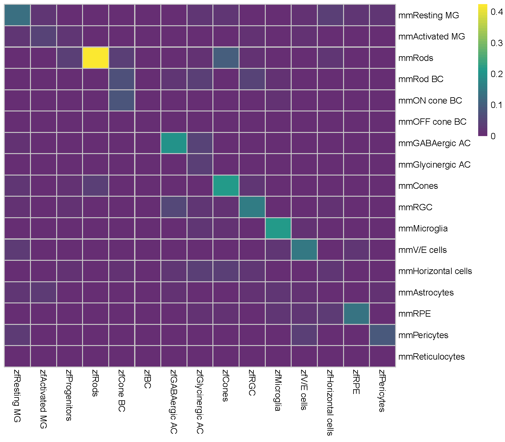
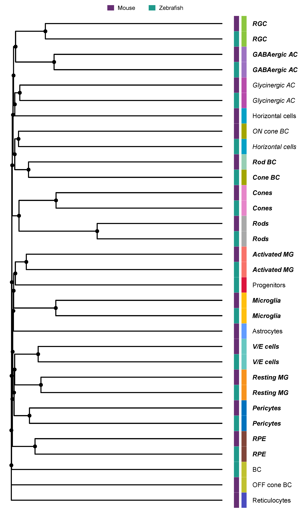
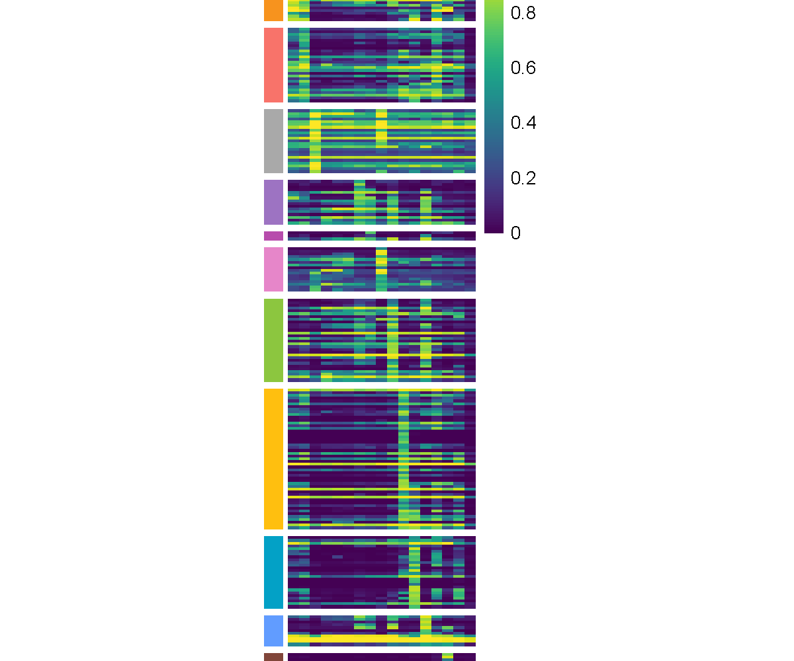
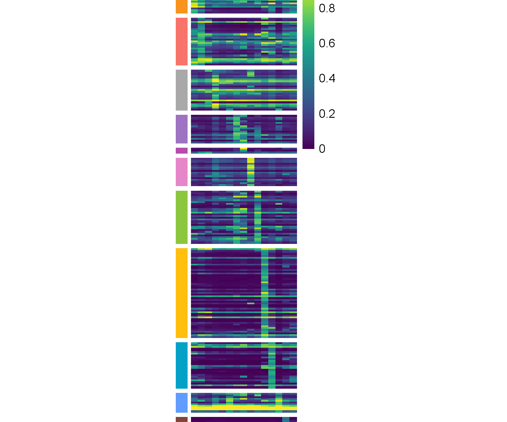
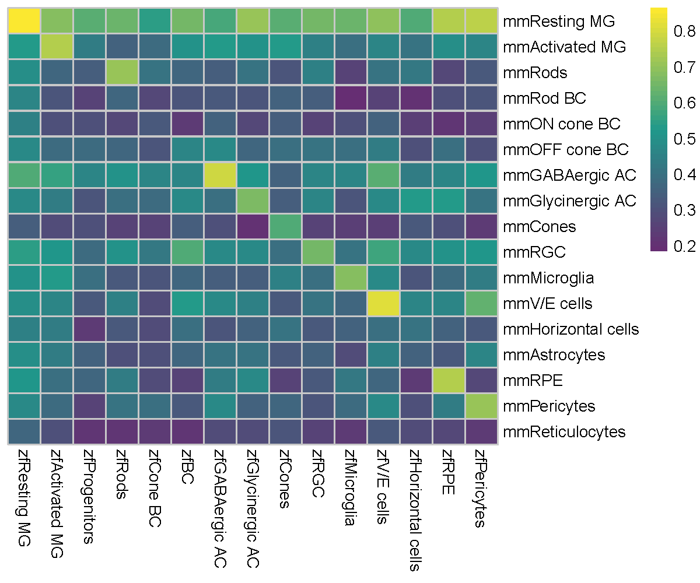
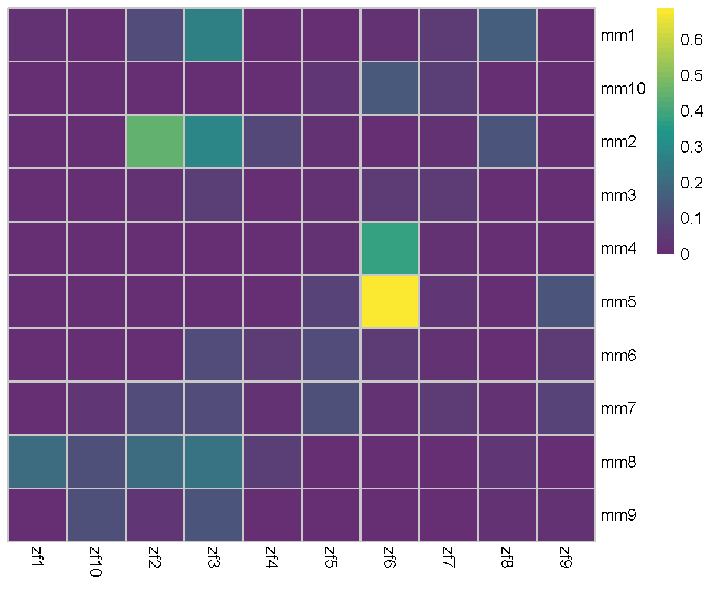
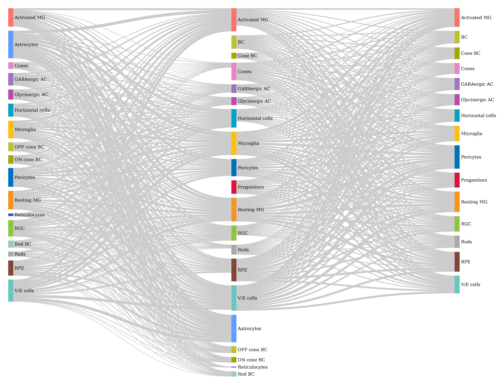

<style>
  body {
  font-family: "Helvetica";
    font-size: 18px;
    color: black;
  }
</style>

```{r setup, include=FALSE}
## Global options
knitr::opts_chunk$set(cache = TRUE)
```

# Installation

Follow the steps below to install CACIMAR package from GitHub and run it:

``` r
# install
# install.packages("devtools") # Install devtools if not already installed
devtools::install_github("jiang-junyao/CACIMAR")
# require
library(CACIMAR)
library(reshape2)
```

# 1.Identify markers
  In this part, CACIMAR first uses receiver operating characteristic (ROC) based method in 'FindAllMarkers' function of [Seurat](https://satijalab.org/seurat/articles/get_started.html) to identify markers in each cluster for every species individually. Then, based on marker genes identified above, CACIMAR calculates the power of markers(MP, MP= 2 × abs(AUC-0.5)) in each cluster and the expression differences of markers(logFC) between clusters. Markers with MP > 0.35 and logFC > 0.1 will be retained. 
  
## (1) Inputs data of this part

- ***Seurat object***
  Seurat object should include cell types information in the ‘active.ident’ slot. Test data can be download from [Google drive](https://drive.google.com/drive/folders/15bqQmEH4cDFRiEHYZTEp4gYWK4FJAhBL?usp=sharing)

### (2) Identify markers

```r
### identify markers
Zf_seurat <- readRDS('Zf_seurat.rds')
Mm_seurat <- readRDS('Mm_seurat.rds')
Zf_marker <- Identify_Markers(Zf_seurat,PowerCutoff=0.35, DifferenceCutoff=0.1,PvalueCutoff=0.05)
Mm_marker <- Identify_Markers(Mm_seurat,PowerCutoff=0.35, DifferenceCutoff=0.1,PvalueCutoff=0.05)
### format markers table
Zf_marker <- Format_Markers_Frac(Zf_marker)
Mm_marker <- Format_Markers_Frac(Mm_marker)
```

# 2.Identify evolutionarily conserved cell types
   CACIMAR identifies evolutionarily conserved cell types and poorly conserved cell types utilizing conservation scores of cell types (CSCT) and a phylogenetic tree. 
  
  CSCT is computed based on the powers (or MP values) of shared markers in each pair of cell types, relative to the sum of the powers of all markers in each pair of cell types. Shared markers indicate the markers of one species that have homologs in the other species. If genes have multiple homologs, the gene with the highest power is selected. If the pair of cell types is mutually matched, and CSCT is greater than the third quartile of CSCT values, then this pair of cell types is considered a conserved cell type between two species. Mutually matched pair cell types mean that for every cell type in species 1, we look for the corresponding cell type in species 2 that has the highest CSCT value, and vice versa. The corresponding cell types in both species are said to be “mutually matched,” and they have the highest CSCT value relative to all other cell types in the other species.
  
  Besides, we generate a phylogenetic tree based on the CSCT value using the hierarchical clustering method UPGMA (unweighted pair group method using arithmetic mean) to further identify the conserved cell types and the poorly conserved cell types. If cell types from two species are from the same clade of bipartition, the two cell types are considered conserved cell types across species. However, if these conserved cell types are only identified by the phylogenetic tree of cell types, they are regarded as poorly conserved cell types.

## (1) Inputs data of this part

- ***Marker tables for two species***
  it Should contain three column: 'gene', 'cluster' and 'power'. Marker tables can be generated by 'Identify_Markers' function in part one above. Or, you can use following codes to load test data contained in CACIMAR.

```
load(system.file("extdata", "zf_mm_markers.rda", package = "CACIMAR"))
```
- ***Homologous gene database***
  A homologous gene database is required. CACIMAR has already generated a homologous gene database for human, mouse, zebrafish, and chicken. You can use the following code to load the pre-built database, or you can generate your own homologous gene database using the instructions provided in the “Build homologous gene database” section of the tutorial. To load the pre-built database:
```{r}
### load homologous gene database of human and mouse
OrthG <- OrthG_Hs_Mm
### load homologous gene database of human and chicken
OrthG <- OrthG_Hs_Ch
### load homologous gene database of human and zebrafish
OrthG <- OrthG_Hs_Zf
### load homologous gene database of mouse and chicken
OrthG <- OrthG_Mm_Ch
### load homologous gene database of mouse and zebrafish
OrthG <- OrthG_Mm_Zf
### load homologous gene database of zebrafish and chicken
OrthG <- OrthG_Zf_Ch
```

## (2) Identify evolutionarily conserved cell types

```r
### identify evolutionarily conserved cell types based on conservation score of cell types (CSCT)
OrthG <- OrthG_Mm_Zf
expression <- Identify_ConservedCellTypes(OrthG, Zf_marker, Mm_marker,'zf','mm')
SCT_matrix <- expression[[2]]
SNT_h <- SNT[grep('mm',rownames(SCT_matrix)),as.numeric(grep('zf',colnames(SCT_matrix)))]
### show the CSCT value with a heatmap
Heatmap_Cor(SNT_h,cluster_cols=F, cluster_rows=F,Color1 = c(rgb(102/255,46/255,115/255),rgb(31/255,153/255,139/255),rgb(251/255,232/255,48/255)))
```



## (3) Further evaluate evolutionarily conserved cell types and poorly conserved cell types through phylogenetic tree
  By default, distinct fonts are employed for tip labels to indicate the evolutionary conservation status of cell types. This allows for differentiation between evolutionarily conserved cell types(bold.italic), poorly conserved cell types(italic), and unconserved cell types(plain). To customize the colors for the tip labels, you can utilize the tiplab_cols parameter and specify the desired color scheme. The default color scheme assigns dark blue to represent evolutionarily conserved cell types, light blue to represent poorly conserved cell types, and grey to represent unconserved cell types. Additionally, if you wish to change the method used for constructing the phylogenetic tree, you can modify the tree_method parameter to "classic Neighbor-Joining" method.

```r
### get the conserved cell types based on the mutually matched and bigger than 3/4 CSCT score
conserved_hm_celltypes <- get_conserved_hm_celltypes(SNT_h)
### generate a phylogenetic tree
p <- Plot_phylogenetic_tree(SCT_matrix = SCT_matrix,
                            tree_method = "hierarchical clustering",
                            species.vector = species.vector, 
                            conserved_hm_celltype = conserved_hm_celltypes,
                            annotation_colors_df = bind_colors,
                            colors_labels = c("Mouse", "Zebrafish")) 

### Show the conservation status of cell types.
head(p$conserved_table, n = 10)
# # A tibble: 10 × 11
# parent  node branch.length label            isTip     x     y branch angle Tip_group        fontface   
# <int> <int>         <dbl> <chr>            <lgl> <dbl> <dbl>  <dbl> <dbl> <fct>            <fct>      
#   1     62     1         0.296 zfRods           TRUE    0.5    18  0.352  202. conserved        bold.italic
# 2     60     2         0.398 zfGABAergic AC   TRUE    0.5    29  0.301  326. conserved        bold.italic
# 3     50     3         0.395 zfMicroglia      TRUE    0.5    13  0.303  146. conserved        bold.italic
# 4     54     4         0.430 zfResting MG     TRUE    0.5     8  0.285   90  conserved        bold.italic
# 5     58     5         0.480 zfGlycinergic AC TRUE    0.5    27  0.260  304. poorly_conserved italic     
# 6     51     6         0.491 zfProgenitors    TRUE    0.5    15  0.255  169. not_conserved    plain      
# 7     56     7         0.459 zfCone BC        TRUE    0.5    22  0.270  248. conserved        bold.italic
# 8     55     8         0.436 zfV/E cells      TRUE    0.5    10  0.282  112. conserved        bold.italic
# 9     63     9         0.394 zfCones          TRUE    0.5    20  0.303  225  conserved        bold.italic
# 10     59    10         0.464 zfActivated MG   TRUE    0.5    16  0.268  180  conserved        bold.italic

```




# 3.Identify evolutionarily conserved markers
  CACIMAR initially employs a **homologous gene database** to enhance the markers identified by the "FindAllMarkers" function using ROC. Markers that are present in the homologous database are then considered as shared markers. Subsequently, CACIMAR identifies markers present in the same cell type across two species and retains them as evolutionarily conserved markers.

## (1) Inputs data of this part
- ***Marker tables for two species***
  First column should be gene name, second column should be cluster corresponding to marker gene. Marker tables can be generated by 'Identify_Markers' function in part one above. Or, you can use following codes to load test data.
```r
load(system.file("extdata", "zf_mm_markers.rda", package = "CACIMAR"))
```

- ***Homologous gene database***
```r
OrthG <- OrthG_Mm_Zf
```

## (2) Find evolutionarily conserved markers 
```{r message=FALSE, eval=FALSE}
ConservedMarker <- Identify_ConservedMarkers(OrthG, Mm_marker, Zf_marker,
                                               Species_name1 = 'mm', Species_name2 = 'zf')
```

### Plot conserved markers
```r
###Adjust the format to make figures of conserved markers
MarkersPlot <- FormatConservedMarkers(ConservedMarker)
###plot conserved markers for mouse
Plot_MarkersHeatmap(MarkersPlot[[1]],cellheight = 1.5,cellwidth = 6,legend = T)
```

```r
###plot conserved markers for zebrafish
Plot_MarkersHeatmap(MarkersPlot[[2]],cellheight = 1.5,cellwidth = 6,legend = T)
```


### Plot species-specific markers
```{r, eval=FALSE}
### Idnetiy Mm specific markers
Mm_specific_markers <- Mm_marker[!Mm_marker$gene %in% ConservedMarker$mmgene
                            ,c(-1,-3,-4,-5)]
Plot_MarkersHeatmap(Mm_specific_markers,cellheight = 0.2,cellwidth = 6)
### Identify Zf specific markers
Zf_specific_markers <- Zf_marker[!Zf_marker$gene %in% ConservedMarker$zfgene
                            ,c(-1,-3,-4,-5)]
Plot_MarkersHeatmap(Zf_specific_markers,cellheight = 0.5,cellwidth = 6)

# The markers heatmap in this part contains too many elements to display, so it will not be shown.
```


# 4. Identify conserved intracellular regulation
  We employed CACIMAR to assess the evolutionary conservation of two separate regulatory networks: cell type-specific regulatory networks and regulatory subnetworks, otherwise known as modules, across various species. CACIMAR calculates the conservation score of regulatory networks (CSRN) for different cell types/modules in regulatory networks of distinct species. CSRN is computed based on two criteria: (I) the proportion of homologous genes (nodes) compared to all genes, and (II) the proportion of interactions (edges) among homologous genes compared to all interactions. A higher CSRN indicates a more conserved regulatory network. 

## (1) Inputs data of this part
- ***Cell type specific network or Modularized regulatory networks for two species***
  Each network should contain 4 columns: 'Source', 'SourceGroup', 'Target', 'TargetGroup'. Modularized regulatory networks can be generated by [IReNA](https://github.com/jiang-junyao/IReNA) or [WGCNA](https://horvath.genetics.ucla.edu/html/CoexpressionNetwork/Rpackages/WGCNA/). Or, you can use following codes to load test data in this part.

```r
load(system.file("extdata", "gene_network.rda", package = "CACIMAR"))
```
- ***Homologous gene database***
```{r}
OrthG <- OrthG_Mm_Zf
```

## (2) Cell type specific regulatory networks analysis
  The following cell type specific regulatory networks are constructed by [IReNA](https://github.com/jiang-junyao/IReNA), which can integrate scRNA-seq and scATAC-seq/ATAC-seq data or use scRNA-seq/RNA-seq data alone to construct modularized regulatory networks. 

```{r warning=FALSE,message=FALSE, eval=FALSE}
ConservedNetworks_ct <- identify_ct_ConservedNetworks(OrthG, Species1_GRN, Species2_GRN, 'mm', 'zf')
Heatmap_Cor(ConservedNetworks_ct[[2]], cluster_cols=F, cluster_rows=F, Color1 = c(rgb(102/255,46/255,115/255), rgb(31/255,153/255,139/255), rgb(251/255,232/255,48/255)))
```



## (3) Modularized regulatory networks analysis
  Modular regulatory networks used here are constructed by R package [IReNA](https://github.com/jiang-junyao/IReNA), which can integrate scRNA-seq and scATAC-seq/ATAC-seq data or use scRNA-seq/RNA-seq data alone to construct modularized regulatory networks. [WGCNA](https://horvath.genetics.ucla.edu/html/CoexpressionNetwork/Rpackages/WGCNA/) is an optional method that can generate the input. However, WGCNA only can construct regulatory networks through bulk RNA-seq data.

```{r warning=FALSE,message=FALSE, eval=FALSE}
ConservedNetworks <- Identify_ConservedNetworks(OrthG, mm_gene_network, zf_gene_network, 'mm', 'zf')
Heatmap_Cor(ConservedNetworks[[2]], cluster_cols=F, cluster_rows=F, Color1 = c(rgb(102/255,46/255,115/255), rgb(31/255,153/255,139/255), rgb(251/255,232/255,48/255)))
```



# 5.Identify conserved intercellular interactions (cell-cell interaction)
  CACIMAR employs the SingleCellSignalR algorithm from [liana](https://saezlab.github.io/liana/) to identify evolutionarily conserved cell-cell interactions (CCI) based on the expression levels of ligands and receptors. CCI that satisfy the following criteria are regarded as evolutionarily conserved: (I) the interactions between ligands and receptors demonstrate consistency, and (II) the cell type of the ligand and receptor in species 1 should correspond to the cell type of the ligand and receptor in species 2, respectively. Subsequently, we compute the proportion of consistent intercellular interactions to gauge the conservation score for intercellular interactions (CSII).

## (1) Inputs data of this part
- ***seurat object***
  Seurat object should include cell types information in the ‘active.ident’ slot. Test data can be download from [Google drive](https://drive.google.com/drive/folders/15bqQmEH4cDFRiEHYZTEp4gYWK4FJAhBL?usp=sharing)

- ***Homologous gene database***
```{r}
OrthG <- OrthG_Mm_Zf
```

## (2) perform cell-cell interaction analysis with SingleCellSignalR algorithm 
```{r, eval=FALSE}
# Mouse analysis
SingleCellSignalR_mouse_result <- perform_CCI_analysis(seurat_obj=Mm_seurat, target_organism=10090)
# Zebrafish analysis
SingleCellSignalR_zebrafish_result <- perform_CCI_analysis(seurat_obj=Zf_seurat, target_organism=7955)
# filter interactions with LRscore > 0.5
SingleCellSignalR_mouse_result2 <- subset(SingleCellSignalR_mouse_result, LRscore > 0.5)
SingleCellSignalR_zebrafish_result2 <- subset(SingleCellSignalR_zebrafish_result, LRscore > 0.5)
```

## (3) overall cell-cell interactions profile across two species
 Here, we summarize the weight of all interactions within each pair of cell types and display the profile with a sankey plot. The left side represents the source of ligands in mouse, the right side represents the source of ligands in zebrafish, and the middle represents all the target receptors shared by both species.
 
```{r, eval=FALSE}
# sum Weights of each cell types
all_weight_df_long <- calculate_Weights(species1_cci = SingleCellSignalR_mouse_result2,
                                        species2_cci = SingleCellSignalR_zebrafish_result2)
# show the weight result
head(all_weight_df_long)
#             source       target    weight species scale_weight             Source            Source2
# 1     Activated MG Activated MG 152.07967      Mm  0.008256281     MmActivated MG     MmActivated MG
# 2       Astrocytes Activated MG 230.97254      Mm  0.012539310       MmAstrocytes       MmAstrocytes
# 3            Cones Activated MG  51.89929      Mm  0.002817570            MmCones            MmCones
# 4     GABAergic AC Activated MG  99.92955      Mm  0.005425093     MmGABAergic AC     MmGABAergic AC
# 5   Glycinergic AC Activated MG  78.95619      Mm  0.004286467   MmGlycinergic AC   MmGlycinergic AC
# 6 Horizontal cells Activated MG 106.23687      Mm  0.005767513 MmHorizontal cells MmHorizontal cells

# used self-defined colors
colors_file = "/data2/jinlianli/CACIMAR/git/Tree3_3/zf_mm_colors.txt"
colors <- read.table(colors_file)
# show the colors dataframe which was used
head(colors)
#   colors     celltype
# 1 #F7931E   Resting MG
# 2 #F8736A Activated MG
# 3 #A9A9A9         Rods
# 4 #96CEB4       Rod BC
# 5 #A3A500   ON cone BC
# 6 #C0C130  OFF cone BC

# sankey plot will be saved in current directory by default
# If the colors_file is set to NULL, the colors will be automatically assigned.
create_sankey(links = all_weight_df_long[, c("Source2", "target", "scale_weight")],
              output_file = "sankey_scale_weight.html",
              specie_name1 = "Mm",
              specie_name2 = "Zf",
              colors_file = "/data2/jinlianli/CACIMAR/git/Tree3_3/zf_mm_colors.txt"
)
```



## (4) identified the evolutionarily conserved cell-cell interactions (CCI)
```{r, eval=FALSE}
## caculate the conservation score for intercellular interactions(CSII)

#########
######### jiangjunyao will continue this part! ######### finish till getting the scaled_ccc_score.rds
#########


# load the test data if you don't want to perform analysis above:
# load(system.file("extdata", "CCC_conserved_sumary.rda", package = "CACIMAR"))
head(CCC_conserved_sumary)
#         Source           Target  con_weight con_num all_sp1_weight all_sp2_weight all_sp1_num all_sp2_num  score_num score_weight
# 1 Activated MG     Activated MG 0.002811320      12    0.008256281    0.006426577         210          15 0.05333333    0.1914696
# 2 Activated MG            Cones 0.001794698       8    0.001755534    0.005373207          44          13 0.14035088    0.2517553
# 3 Activated MG     GABAergic AC 0.001865299       8    0.002642778    0.002575948          67           6 0.10958904    0.3574241
# 4 Activated MG   Glycinergic AC 0.001820697       8    0.002953106    0.003331352          78           8 0.09302326    0.2897142
# 5 Activated MG Horizontal cells 0.002282194      10    0.006309411    0.003770427         164           9 0.05780347    0.2264118
# 6 Activated MG        Microglia 0.004017660      18    0.008025174    0.009509609         206          23 0.07860262    0.2291252

## ChordDiagram shows the CSII 
# data for ChordDiagram
cci_data <- CCC_conserved_sumary[, c("Source", "Target", "score_weight")]
head(cci_data)
#         Source           Target score_weight
# 1 Activated MG     Activated MG    0.1914696
# 2 Activated MG            Cones    0.2517553
# 3 Activated MG     GABAergic AC    0.3574241
# 4 Activated MG   Glycinergic AC    0.2897142
# 5 Activated MG Horizontal cells    0.2264118
# 6 Activated MG        Microglia    0.2291252

# colors for ChordDiagram
# if you don't want to make colors for ChordDiagram, just set grid.col = NULL
colors <- c(rgb(247/255,147/255,30/255), rgb(248/255,115/255,106/255), rgb(169/255,169/255,169/255), 
            rgb(150/255,206/255,180/255), rgb(163/255,165/255,0/255), rgb(192/255,193/255,48/255), 
            rgb(157/255,115/255,194/255), rgb(183/255,76/255,171/255), rgb(230/255,134/255,201/255), 
            rgb(140/255,198/255,63/255), rgb(255/255,191/255,15/255), rgb(103/255,199/255,193/255), 
            rgb(3/255,161/255,198/255), rgb(97/255,156/255,255/255), rgb(129/255,70/255,58/255), 
            rgb(0/255,114/255,189/255), rgb(74/255,76/255,191/255))
grid.col_name <- c("Resting MG", "Activated MG", "Rods", "Rod BC", "ON cone BC", "OFF cone BC", "GABAergic AC", "Glycinergic AC", "Cones", "RGC", "Microglia", "V/E cells", "Horizontal cells", "Astrocytes", "RPE", "Pericytes", "Reticulocytes")
names(colors) <- grid.col_name
grid.col <- colors[c(unique(cci_data$Source), unique(cci_data$Target))]

# plot ChordDiagram
ChordDiagram(net = cci_data, 
             grid.col = grid.col,
             order_grid = grid.col_name,
             filename = "chordDiagram_cutoff0.75.pdf",
             link_colors_threshold = 0.75)
```


## (5) show the conserved ligand-receptor pairs 
```{r, eval=FALSE}
# We only display the ligand-receptor pairs in the cell type pairs where the CSII is greater than or equal to the third quantile value of CSII
CCC_conserved_sumary_0.75 <- subset(CCC_conserved_sumary, score_weight >= quantile(CCC_conserved_sumary$score_weight, probs = 0.75))
LRpair_show_all <- data.frame("LR" = paste(mm_conserved_CCC$sp1ligand.complex, mm_conserved_CCC$sp1receptor.complex, sep = "_"), "Cell_Pair" = paste(mm_conserved_CCC$sp1source, mm_conserved_CCC$sp1target, sep = "_")) 
index_0.75 <- as.vector(unlist(sapply(paste(CCC_conserved_sumary_0.75$Source, CCC_conserved_sumary_0.75$Target, sep = "_"), function(x) grep(x, LRpair_show_all$Cell_Pair))))
LRpair_show_0.75 <- LRpair_show_all[index_0.75,]
# We can create a group variable that determines the colors for both the text and points 
LRpair_show_0.75$group <- as.vector(unlist(sapply(LRpair_show_0.75$Cell_Pair, function(x) strsplit(x, split = "_")[[1]][1])))
head(LRpair_show_0.75)
#             LR                   Cell_Pair        group
# 38     App_Rpsa   Activated MG_GABAergic AC Activated MG
# 168   App_Aplp2   Activated MG_GABAergic AC Activated MG
# 391   App_Aplp1   Activated MG_GABAergic AC Activated MG
# 438 Ncam1_Gfra1   Activated MG_GABAergic AC Activated MG
# 41     App_Rpsa Activated MG_Glycinergic AC Activated MG
# 171   App_Aplp2 Activated MG_Glycinergic AC Activated MG

# we use the colors above, or you can set fill_colors = NULL
# LR_data should only contain 3 columns, representing LR pairs, Cell type pairs, and groups
show_LR_pairs(LR_data = LRpair_show_0.75, fill_colors = colors, color_x_in_group = T)
```


# Build homologous gene database
  Under the situation that homologous gene database of your interested species is not included in our package, CACIMAR provides to build your own homologous gene database according to MGI database. 

*Hint* Only github version of CACIMAR supports this part

## (1) Inputs data of this part

- ***MGI database***
  MGI database can be downloaded from http://www.informatics.jax.org/downloads/reports/HOM_AllOrganism.rpt.

- ***species name***
  Currently CACIMAR is able to build homologous gene database for the following species:
  
```
1) 'mm' for mouse; 
2) 'zf' for zebrafish; 
3) 'hs' for human; 
4) 'ch' for chicken; 
5) 'cf' for dog; 
6) 'pt' for chimpanzee; 
7) 'xt' for frog; 
8) 'rn' for rat; 
9) 'bt' for cattle; 
10) 'rh' for macaque
```

## (2) Example for build homologous gene database
```r
### download data
download.file(destfile = 'D:\\GIBH\\platform\\OrthG database/HOM.txt',url = 'http://www.informatics.jax.org/downloads/reports/HOM_AllOrganism.rpt')
### load data
HOM=read.delim('D:\\GIBH\\platform\\OrthG database/HOM.txt')
### build homologous gene database for dog and mouse
Species_name1 <- 'cf'
Species_name2 <- 'mm'
OrthG_Cf_Mm <- buildHomDatabase(HOM, Species_name1, Species_name2)
```


