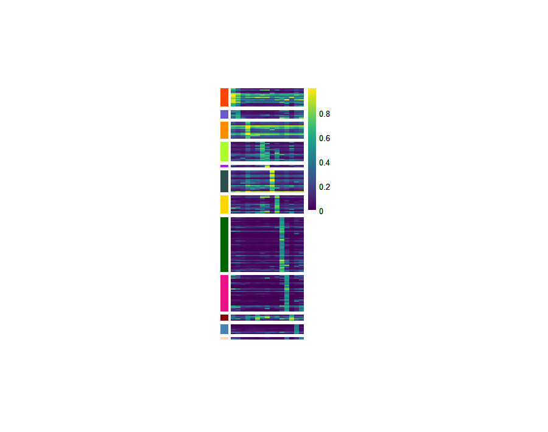
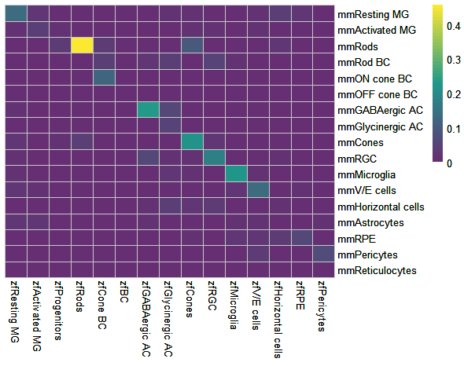

```{r setup, include=FALSE}
## Global options
knitr::opts_chunk$set(cache = TRUE)
```

# Installation

Install CACIMAR from github, run:

``` r
# install.packages("devtools")
devtools::install_github("jiang-junyao/CACIMAR")
```
# Initiation

```{r warning=FALSE,message=FALSE}
library(CACIMAR)
library(reshape2)
```
# 1.Identify markers
In this part, CACIMAR first uses ROC based method in 'FindAllMarkers' function of [Seurat](https://satijalab.org/seurat/articles/get_started.html) to identify markersin each cluster. Then, based on marker genes identified above, CACIMAR calculates the power of markers in each cluster and differences of markers between clusters, and markers with high differences between clusters will be retained. Finally, CACIMAR uses chi-square test/fisher test to identify significant cluster related to this marker gene (p.value <0.05).

## Inputs data of this part

### (1) Seurat object
Seurat object should have clusters information in 'active.ident' slot. Test data used here can be download from [Google drive](https://drive.google.com/drive/folders/15bqQmEH4cDFRiEHYZTEp4gYWK4FJAhBL?usp=sharing)

## Example

```r
### identify markers
Zf_seurat <- readRDS('Zf_seurat.rds')
Mm_seurat <- readRDS('Mm_seurat.rds')
Zf_marker <- Identify_Markers(Zf_seurat,PowerCutoff=0.4,DifferenceCutoff=0.1,PvalueCutoff=0.05)
Mm_marker <- Identify_Markers(Mm_seurat,PowerCutoff=0.4,DifferenceCutoff=0.1,PvalueCutoff=0.05)
### format markers table
Zf_marker <- Format_Markers_Frac(Zf_marker)
Mm_marker <- Format_Markers_Frac(Mm_marker)
```
However, Zf_seurat and Mm_seurat contain about 40 thousand of cells which leads to super long running time. So i recommend subset the seurat object to just use cluster 1,2,3 to try this function.
```r
Zf_marker_subset <- Identify_CellType(Zf_subset,PowerCutoff=0.4,DifferenceCutoff=0.1,PvalueCutoff=0.05)
```


# 2.Identify evolution-conserved markers
In this part, CACIMAR first uses **homologous genes database** to refine markers, markers that exist in orthologs database will be retained. Then, CACIMAR selects markers that are in the same cell type between two species as evolution-conserved markers.

## Inputs data of this part
### (1) Marker tables for two species
First column should be gene name, second column should be cluster corresponding to marker gene. Marker tables can be generated by 'Identify_Markers' function in part one.

You can use following codes to load test data in this part.
```
load(system.file("extdata", "zf_mm_markers.rda", package = "CACIMAR"))
```

### (2) Homologous gene database
CACIMAR has already generated Homologous gene database for human, mouse, zebrafish and chicken, you can directly use the following codes to load database:
```{r,message=FALSE,warning=FALSE}
### load homologous gene database of human and mouse
OrthG <- OrthG_Hs_Mm
### load homologous gene database of human and chicken
OrthG <- OrthG_Hs_Ch
### load homologous gene database of human and zebrafish
OrthG <- OrthG_Hs_Zf
### load homologous gene database of mouse and chicken
OrthG <- OrthG_Mm_Ch
### load homologous gene database of mouse and zebrafish
OrthG <- OrthG_Mm_Zf
### load homologous gene database of zebrafish and chicken
OrthG <- OrthG_Zf_Ch
```
In addition, you can use function in 'Build homologous gene database' part to generate your own homologous gene database.

## Example
```{r message=FALSE}
### load test data
load(system.file("extdata", "zf_mm_markers.rda", package = "CACIMAR"))
### identify evolution-conserved markers
ConservedMarker <- Identify_ConservedMarkers(OrthG_Mm_Zf,Mm_marker,Zf_marker,
                                               Species_name1 = 'mm',Species_name2 = 'zf')
```
Plot conserved markers
```r
###Adjust the format to make figures of conserved markers
MarkersPlot <- FormatConservedMarkers(ConservedMarker)
###plot conserved markers for mouse
Plot_MarkersHeatmap(MarkersPlot[[1]],cellheight = 1.5,cellwidth = 6,legend = T)
```

```r
###plot conserved markers for zebrafish
Plot_MarkersHeatmap(MarkersPlot[[2]],cellheight = 1.5,cellwidth = 6,legend = T)
```


Plot species-specific markers
```{r}
### Idnetiy Mm specific markers
Mm_specific_markers <- Mm_marker[!Mm_marker$gene %in% ConservedMarker$mmgene
                            ,c(-1,-3,-4,-5)]
Plot_MarkersHeatmap(Mm_specific_markers,cellheight = 0.2,cellwidth = 6)
### Identify Zf specific markers
Zf_specific_markers <- Zf_marker[!Zf_marker$gene %in% ConservedMarker$zfgene
                            ,c(-1,-3,-4,-5)]
Plot_MarkersHeatmap(Zf_specific_markers,cellheight = 0.5,cellwidth = 6)


```


# 3.Identify evolution-conserved cell types
In this part, CACIMAR identify evolution-conserved cell types based on score of conserved cell types (SCT). SCT is calculated according to the power of evolution-conserved markers in each cluster and power of all markers in each cluster.

## Inputs data of this part

### (1) Marker tables for two species
Should contain three column: 'gene', 'cluster' and 'power'. Marker tables can be generated by 'Identify_Markers' function in part one.

You can use following codes to load test data in this part.
```
load(system.file("extdata", "zf_mm_markers.rda", package = "CACIMAR"))
```

### (2) Homologous gene database
CACIMAR has already generated Homologous gene database for human, mouse, zebrafish and chicken, you can directly use the following codes to load database:
```{r}
### load homologous gene database of human and mouse
OrthG <- OrthG_Hs_Mm
### load homologous gene database of human and chicken
OrthG <- OrthG_Hs_Ch
### load homologous gene database of human and zebrafish
OrthG <- OrthG_Hs_Zf
### load homologous gene database of mouse and chicken
OrthG <- OrthG_Mm_Ch
### load homologous gene database of mouse and zebrafish
OrthG <- OrthG_Mm_Zf
### load homologous gene database of zebrafish and chicken
OrthG <- OrthG_Zf_Ch
```
In addition, you can use function in 'Build homologous gene database' part to generate your own homologous gene database.

## Example
```r
### identify evolution conserved markers based on power of markers
expression <- Identify_ConservedCellTypes(OrthG_Mm_Zf,Zf_marker,Mm_marker,'zf','mm')
SNT <- expression[[2]]
SNT <- SNT[grep('mm',rownames(SNT)),as.numeric(grep('zf',colnames(SNT)))]
Heatmap_Cor(SNT,cluster_cols=F, cluster_rows=F,Color1 = c(rgb(102/255,46/255,115/255),rgb(31/255,153/255,139/255),rgb(251/255,232/255,48/255)))
```



# 4. Identify conserved intracellular regulation
In this part, we utilized CACIMAR to examine the evolutionary conservation of two distinct regulatory networks: cell type-specific regulatory networks and regulatory subnetworks, also known as modules, across different species. CACIMAR calculates the score of conserved networks (SCN) among celltypes/modules in regulatory networks of different species. SCN is calculated according to three criterion: (I) fraction of homologous genes (nodes) and all genes; (II) fraction of interactions (edges) among homologous genes and all interactions.

## Inputs data of this part
### (1) Cell type specific network or Modularized regulatory networks for two species
Each network should contain 4 columns: 'Source', 'SourceGroup', 'Target', 'TargetGroup'. Modularized regulatory networks can be generated by [IReNA](https://github.com/jiang-junyao/IReNA) or [WGCNA](https://horvath.genetics.ucla.edu/html/CoexpressionNetwork/Rpackages/WGCNA/).

You can use following codes to load test data in this part.
```
load(system.file("extdata", "gene_network.rda", package = "CACIMAR"))
```

### (2) Homologous gene database
CACIMAR has already generated Homologous gene database for human, mouse, zebrafish and chicken, you can directly use the following codes to load database:
```{r}
### load homologous gene database of human and mouse
OrthG <- OrthG_Hs_Mm
### load homologous gene database of human and chicken
OrthG <- OrthG_Hs_Ch
### load homologous gene database of human and zebrafish
OrthG <- OrthG_Hs_Zf
### load homologous gene database of mouse and chicken
OrthG <- OrthG_Mm_Ch
### load homologous gene database of mouse and zebrafish
OrthG <- OrthG_Mm_Zf
### load homologous gene database of zebrafish and chicken
OrthG <- OrthG_Zf_Ch
```
In addition, you can use function in 'Build homologous gene database' part to generate your own homologous gene database.

## Example of cell type specific regulatory networks analysis
The following cell type specific regulatory networks are constructed by [IReNA](https://github.com/jiang-junyao/IReNA), which can integrate scRNA-seq and scATAC-seq/ATAC-seq data or use scRNA-seq/RNA-seq data alone to construct modularized regulatory networks. 

```{r warning=FALSE,message=FALSE}
### load test data
load(system.file("extdata", "ct_network.rda", package = "CACIMAR"))
### identify evolution-conserved regulatory networks
ConservedNetworks_ct <- identify_ct_ConservedNetworks(OrthG_Mm_Zf,Species1_GRN,Species2_GRN,'mm','zf')
Heatmap_Cor(ConservedNetworks_ct[[2]],cluster_cols=F, cluster_rows=F,Color1 = c(rgb(102/255,46/255,115/255),rgb(31/255,153/255,139/255),rgb(251/255,232/255,48/255)))
```

## Example of modularized regulatory networks analysis
Modular regulatory networks used here are constructed by R package [IReNA](https://github.com/jiang-junyao/IReNA), which can integrate scRNA-seq and scATAC-seq/ATAC-seq data or use scRNA-seq/RNA-seq data alone to construct modularized regulatory networks. [WGCNA](https://horvath.genetics.ucla.edu/html/CoexpressionNetwork/Rpackages/WGCNA/) is an optional method that can generate the input. However, WGCNA only can construct regulatory networks through bulk RNA-seq data.

```{r warning=FALSE,message=FALSE}
### load test data
load(system.file("extdata", "gene_network.rda", package = "CACIMAR"))
### identify evolution-conserved regulatory networks
ConservedNetworks <- Identify_ConservedNetworks(OrthG_Mm_Zf,mm_gene_network,zf_gene_network,'mm','zf')
Heatmap_Cor(ConservedNetworks[[2]],cluster_cols=F, cluster_rows=F,Color1 = c(rgb(102/255,46/255,115/255),rgb(31/255,153/255,139/255),rgb(251/255,232/255,48/255)))
```


# 5.Identify conserved intercellular interactions (cell-cell interaction)
In this part, CACIMAR identify evolution-conserved CCC based on CCC at level of ligands/receptors from [cellchat](http://www.cellchat.org/). CCC fulfill the following criteria will be considered as evolution-conserved CCC: (I) interactions between ligands and receptors are consistent (consistent interaction is defined in part 5); (II) cell type of ligand and cell type of receptor in species 1 should be the same as cell type of ligand and cell type of receptor in species2 respectively

## Inputs data of this part
### (1) CCC dataframe
CCC df contains 4 columns, first column should be ligands, second column should be receptors, third column should be corresponding cell type of ligand, fourth column should be corresponding cell type of receptor
```{r}
load(system.file("extdata", "cci_test.rda", package = "CACIMAR"))
print(hs_cci_test)
```


### (2) Homologous gene database
CACIMAR has already generated Homologous gene database for human, mouse, zebrafish and chicken, you can directly use the following codes to load database:
```{r}
### load homologous gene database of human and mouse
OrthG <- OrthG_Hs_Mm
### load homologous gene database of human and chicken
OrthG <- OrthG_Hs_Ch
### load homologous gene database of human and zebrafish
OrthG <- OrthG_Hs_Zf
### load homologous gene database of mouse and chicken
OrthG <- OrthG_Mm_Ch
### load homologous gene database of mouse and zebrafish
OrthG <- OrthG_Mm_Zf
### load homologous gene database of zebrafish and chicken
OrthG <- OrthG_Zf_Ch
```
In addition, you can use function in 'Build homologous gene database' part to generate your own homologous gene database.

## Example
Example dataset (mm_ccc.rds & zf_ccc.rds) can be download from [onedrive](https://westlakeu-my.sharepoint.com/:f:/g/personal/jiangjunyao_westlake_edu_cn/ElAKLi2XcIVHp8QV97hMRyQBI2mu_MQcb9zDGfd6TML_QQ?e=bfmhtC)
```r
### load test data
mm_ccc <- readRDS('mm_ccc.rds')
zf_ccc <- readRDS('zf_ccc.rds')
### extract signalings dataframe
mm.net <- subsetCommunication(mm_ccc)
zf.net <- subsetCommunication(zf_ccc)
mm.input <- mm.net[,c(3,4,1,2)]
zf.input <- zf.net[,c(3,4,1,2)]
### identify conserved CCC
ConservedCCI <- Identify_ConservedCCI(OrthG,mm.input,zf.input,
                      Species_name1='mm',Species_name2='zf')
### add interactions probability from cellchat
mm.ccc.score = add_cellchat_prob(ConservedCCI[[1]],mm.net)
zf.ccc.score = add_cellchat_prob(ConservedCCI[[2]],zf.net)
print(mm.ccc.score)
```
```{r echo=FALSE}
### load test data
mm.ccc.score <- read.delim("F:/platform/cci/mm_conserved_ccc_score.txt")
zf.ccc.score <- read.delim("F:/platform/cci/zf_conserved_ccc_score.txt")
df=read.delim('F:\\platform\\cci/mm_conserved_ccc_score.txt')
print(df)
```
Then, we visualize the result
```{r warning=FALSE}
### visualize mm conserved ccc
mm.ccc.plot=dcast(mm.ccc.score[,3:5],sp1source~sp1target,sum,value.var = 'prob')
rownames(mm.ccc.plot)=mm.ccc.plot[,1]
mm.ccc.plot=mm.ccc.plot[,2:ncol(mm.ccc.plot)]
Heatmap_Cor(mm.ccc.plot,cluster_cols=F, cluster_rows=F,Color1 = c(rgb(102/255,46/255,115/255),rgb(31/255,153/255,139/255),rgb(251/255,232/255,48/255)))
### visualize zf conserved ccc
zf.ccc.plot=dcast(zf.ccc.score[,3:5],sp2source~sp2target,sum,value.var = 'prob')
rownames(zf.ccc.plot)=zf.ccc.plot[,1]
zf.ccc.plot=zf.ccc.plot[,2:ncol(zf.ccc.plot)]
Heatmap_Cor(zf.ccc.plot,cluster_cols=F, cluster_rows=F,Color1 = c(rgb(102/255,46/255,115/255),rgb(31/255,153/255,139/255),rgb(251/255,232/255,48/255)))
```


# Build homologous gene database
Under the situation that homologous gene database of your interested species is not included in our package, CACIMAR provides to build your own homologous gene database according to MGI database. 

*Hint* Only github version of CACIMAR supports this part

## Inputs data of this part

### MGI database
MGI database can be downloaded from http://www.informatics.jax.org/downloads/reports/HOM_AllOrganism.rpt.

### species name
Currently CACIMAR is able to build homologous gene database for the following species:

'mm' for mouse

'zf' for zebrafish

'hs' for human

'ch' for chicken

'cf' for dog

'pt' for chimpanzee

'xt' for frog

'rn' for rat

'bt' for cattle

'rh' for macaque

## Example
```r
### download data
download.file(destfile = 'D:\\GIBH\\platform\\OrthG database/HOM.txt',url = 'http://www.informatics.jax.org/downloads/reports/HOM_AllOrganism.rpt')
### load data
HOM=read.delim('D:\\GIBH\\platform\\OrthG database/HOM.txt')
### build homologous gene database for dog and mouse
Species_name1 <- 'cf'
Species_name2 <- 'mm'
OrthG_Cf_Mm <- buildHomDatabase(HOM,Species_name1,Species_name2)
```


