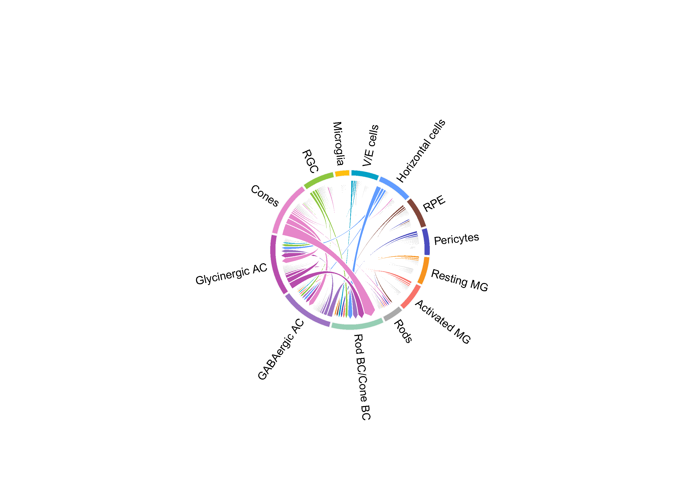
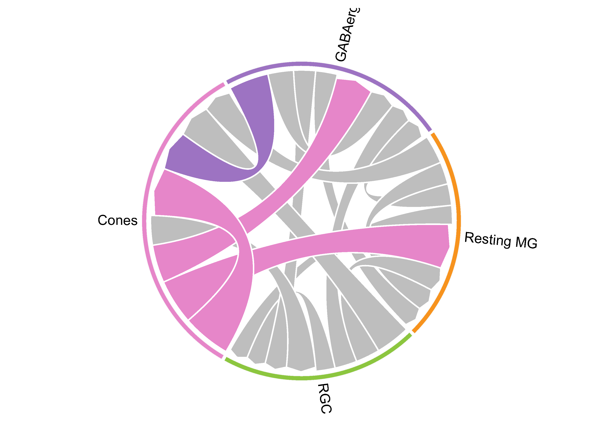

<style>
  body {
  font-family: "Helvetica";
    font-size: 16px;
    color: black;
  }
</style>

```{r setup, include=FALSE}
## Global options
knitr::opts_chunk$set(cache = TRUE)
```

# Introduction
This tutorial is made for users who want to quickly use CACIMAR to identify conserved interaction from two or three species.

# Perform cell-cell interaction analysis
```{r, eval=FALSE}
# By default, we contained the interactions that have a LRscore greater than 0.5 and scale the LRscore
library(CACIMAR)
SingleCellSignalR_mouse_result <- perform_CCI_analysis(seurat_obj=Mm_seurat, target_organism=10090)
SingleCellSignalR_zebrafish_result <- perform_CCI_analysis(seurat_obj=Zf_seurat, target_organism=7955)
SingleCellSignalR_chick_result <- perform_CCI_analysis(seurat_obj=ch_seurat, target_organism=9031)
```

or, you can run the test data
``` {r, eval=FALSE}
load(system.file("extdata", "SingleCellSignalR_results.rda", package = "CACIMAR"))
```


# Two species
```{r, eval=FALSE}
all_weight_df_long_Mm_zf <- calculate_Weights(species1_cci = SingleCellSignalR_mouse_result,
                                              species2_cci = SingleCellSignalR_zebrafish_result,
                                              specie_name1 = "mm",
                                              specie_name2 = "zf")

# sankey plot will be saved in current directory by default
# If the colors_file is set to NULL, the colors will be automatically assigned.
create_sankey(links = all_weight_df_long_Mm_zf[, c("Source2", "target", "scale_weight")],
              output_file = "Mm_Zf_sankey.html",
              specie_name1 = "mm",
              specie_name2 = "zf")
```


```{r, eval=FALSE}
## caculate the conservation score for intercellular interactions(CSII)
# mm and zf conserved score of interaction
conserved_cell_types_mm_zf <- data.frame("mm" = c("mmRods", "mmRod BC", "mmCones", "mmPericytes", "mmV/E cells", "mmRGC", "mmGABAergic AC", "mmRPE", "mmResting MG", "mmActivated MG", "mmMicroglia", "mmGlycinergic AC", "mmHorizontal cells"), "zf" = c("zfRods", "zfCone BC", "zfCones", "zfPericytes", "zfV/E cells", "zfRGC", "zfGABAergic AC", "zfRPE", "zfResting MG", "zfActivated MG", "zfMicroglia", "zfGlycinergic AC", "zfHorizontal cells"))
conserved_result_mm_zf <- Identify_Conserved_CCI1(species1_cci=SingleCellSignalR_mouse_result,
                                                 species2_cci=SingleCellSignalR_zebrafish_result,
                                                 conserved_cell_types_df=conserved_cell_types_mm_zf,
                                                 species_name1 = "mm",
                                                 species_name2 = "zf")
cci_conserved_Weights_table_mm_zf <- Caculate_cell_pair_cci_score(conserved_result_df=conserved_result_mm_zf,
                                                                  species1_cci = SingleCellSignalR_mouse_result,
                                                                  species2_cci = SingleCellSignalR_zebrafish_result,
                                                                  conserved_cell_types_df = conserved_cell_types_mm_zf,
                                                                  species_name1 = "mm",
                                                                  species_name2 = "zf")
cci_data_mm_zf <- Make_ChordDiagram_data(cci_conserved_Weights_table = cci_conserved_Weights_table_mm_zf, species_name1 = "mm", species_name2 = "zf")
## ChordDiagram shows the CSII
ChordDiagram(net = cci_data_mm_zf, filename = paste("mm", "zf", "chordDiagram.pdf", sep = "_"))
```




# Three species

```{r, eval=FALSE}
all_weight_df_long_Mm_zf <- calculate_Weights(species1_cci = SingleCellSignalR_mouse_result,
                                              species2_cci = SingleCellSignalR_zebrafish_result,
                                              specie_name1 = "mm",
                                              specie_name2 = "zf")
all_weight_df_long_Mm_ch <- calculate_Weights(species1_cci = SingleCellSignalR_mouse_result,
                                              species2_cci = SingleCellSignalR_chick_result,
                                              specie_name1 = "mm",
                                              specie_name2 = "ch")
all_weight_df_long_zf_ch <- calculate_Weights(species1_cci = SingleCellSignalR_zebrafish_result,
                                              species2_cci = SingleCellSignalR_chick_result,
                                              specie_name1 = "zf",
                                              specie_name2 = "ch")
```

```{r, eval=FALSE}
# Our function to find the conserved interaction using the celltype'names with prefix, so, the conserved cell types provided should be in prefix+celltype, like mmResting MG
conserved_cell_types_mm_zf_ch <- data.frame('mm' = c("mmResting MG","mmGABAergic AC", "mmRGC", "mmCones"), "zf" = c("zfResting MG", "zfGABAergic AC", "zfRGC", "zfCones"), 'ch' = c("chResting MG","chGABAergic AC", "chRGC", "chCones"))
conserved_result_mm_zf_ch <- Identify_Conserved_CCI2(species1_cci=SingleCellSignalR_mouse_result,
                                                     species2_cci=SingleCellSignalR_zebrafish_result,
                                                     species3_cci = SingleCellSignalR_chick_result,
                                                     conserved_cell_types_df=conserved_cell_types_mm_zf_ch,
                                                     species_name1 = "mm",
                                                     species_name2 = "zf",
                                                     species_name3 = "ch")
conserved_cci_result <- conserved_interaction_score(conserved_result_species = conserved_result_mm_zf_ch,
                                                    SingleCellSignalR_sp1_result = SingleCellSignalR_mouse_result,
                                                    SingleCellSignalR_sp2_result = SingleCellSignalR_zebrafish_result,
                                                    SingleCellSignalR_sp3_result = SingleCellSignalR_chick_result,
                                                    conserved_cell_types_df = conserved_cell_types_mm_zf_ch,
                                                    species_name1 = "mm",
                                                    species_name2 = "zf",
                                                    species_name3 = "ch")
# We visualize the CSII of conserved cell types in three species through ChordDiagram
ChordDiagram(net = conserved_cci_result$chordDiagram_data,filename = paste(species_name1, species_name2, species_name3, "chordDiagram.pdf", sep = "_"))
```




