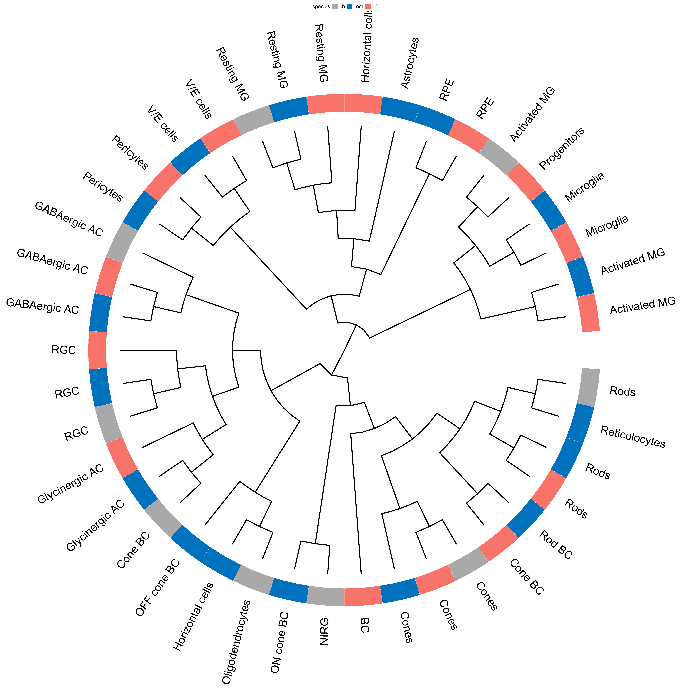
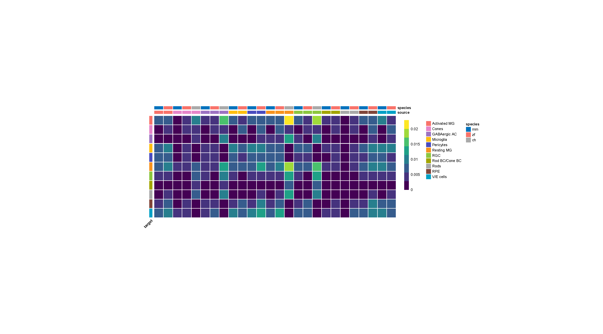
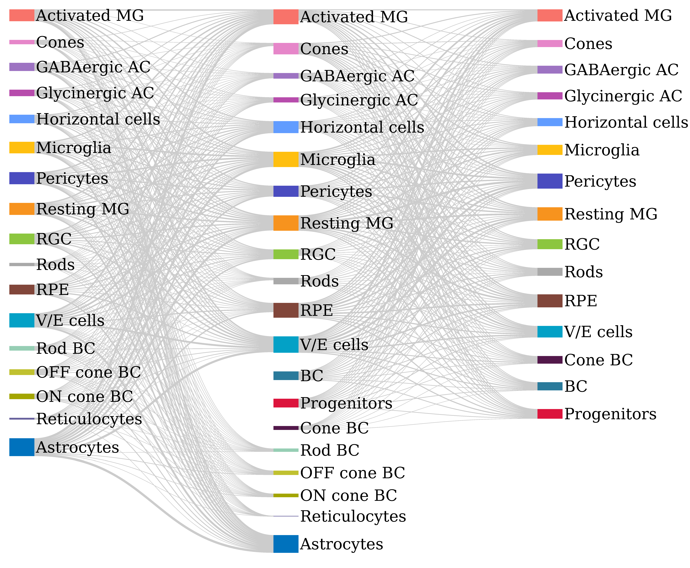
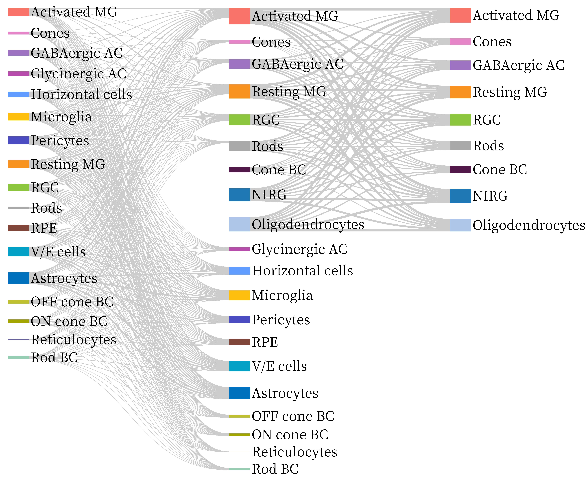
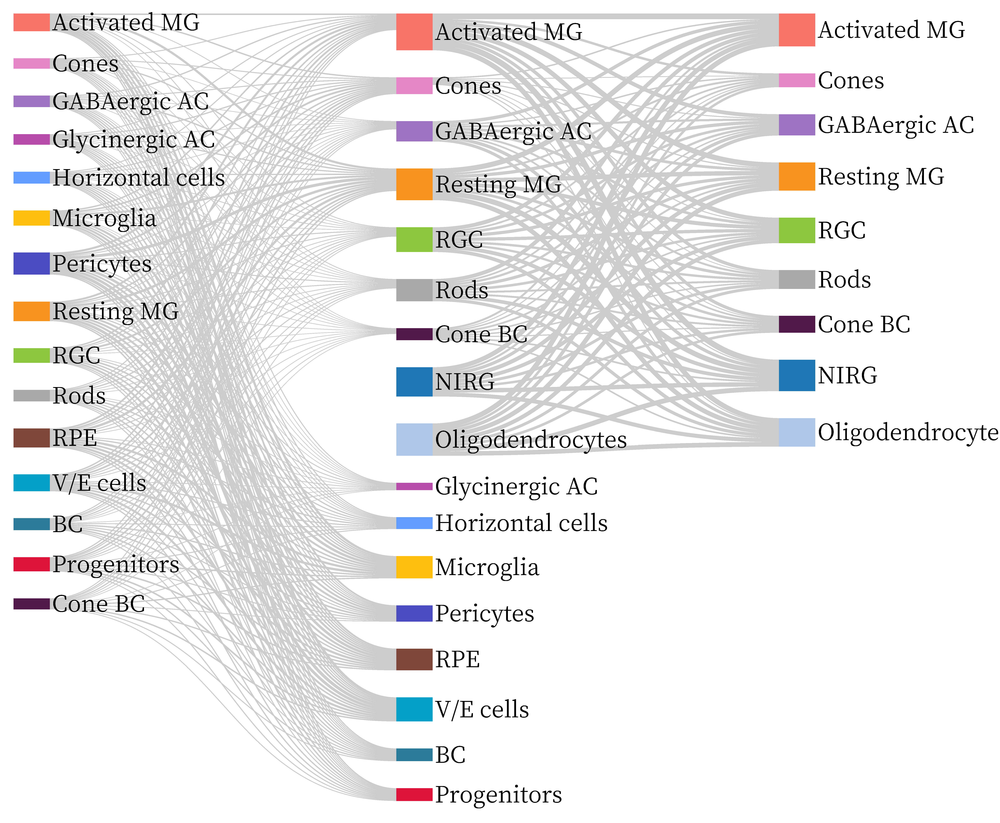
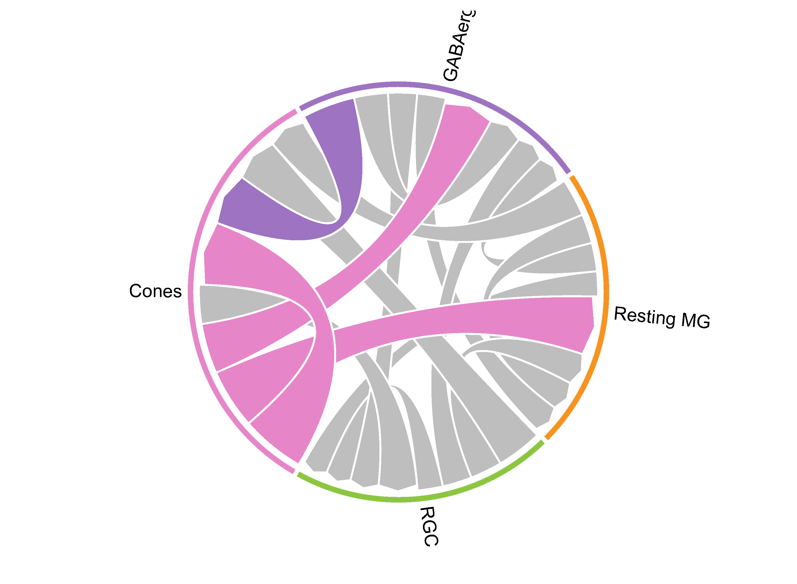
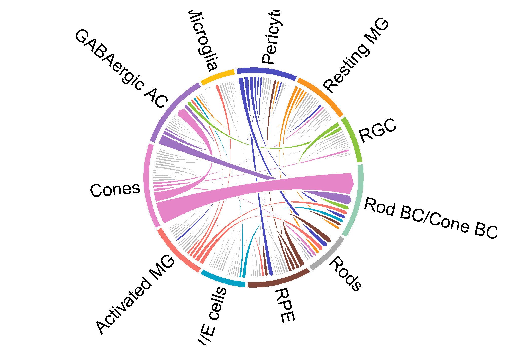
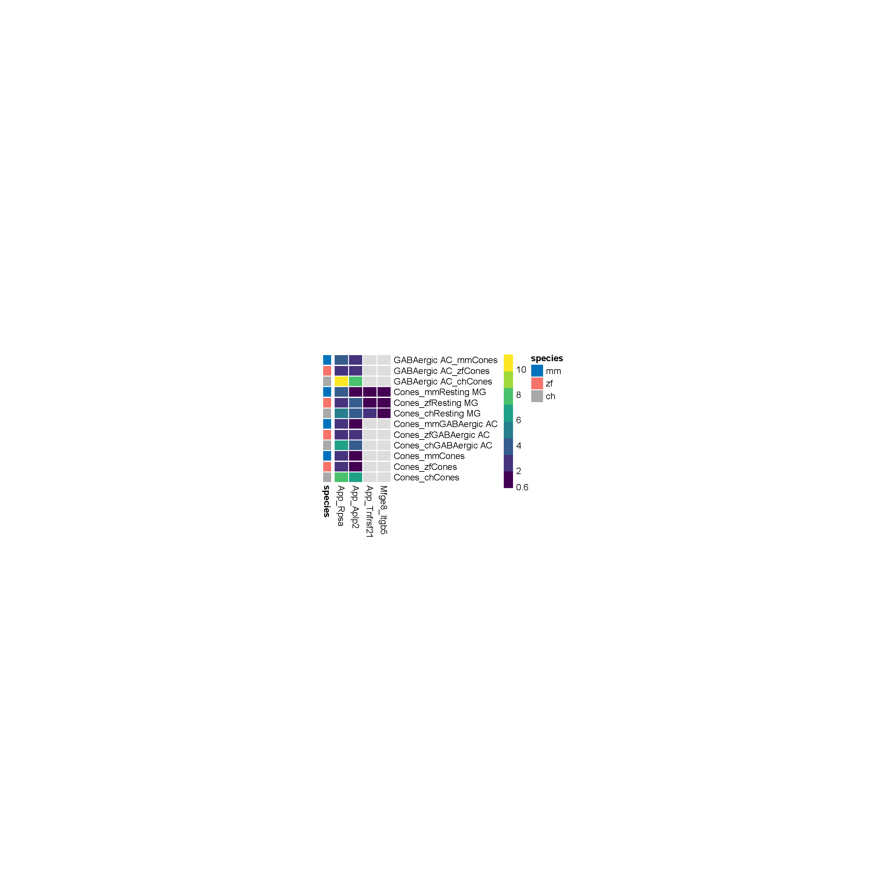

<style>
  body {
  font-family: "Helvetica";
    font-size: 16px;
    color: black;
  }
</style>

```{r setup, include=FALSE}
## Global options
knitr::opts_chunk$set(cache = TRUE)
library(CACIMAR)
```

# Introduction
In this tutorial, we present a method for analyzing cross-species single-cell RNA sequencing (scRNA-seq) data, specifically focusing on the analysis of three species. We utilize a tool called CACIMAR to perform this analysis. As a demonstration, we employ publicly available scRNA-seq data from retina regeneration in three different species (mouse,zebrafish,chick). ([Gene regulatory networks controlling vertebrate retinal regeneration](https://www.science.org/doi/full/10.1126/science.abb8598?casa_token=856P-TqJW-cAAAAA%3AI6FwPF4czCTx9__i_yDbVxx_SUIxQrkfTLe4nvf9arlBA3TKXc1VS920xDef53FJQe16q6_z2K8)).

# Tutorial

In this tutorial, we analyze retina regeneration scRNA-seq data from mouse, zebrafish, and chick to identify conserved markers, cell types, intracellular regulations and intercellular interactions in the retina between mice and zebrafish. This tutorial contains following 5 steps: 


# Step1: Identify markers
  In this part, CACIMAR first used receiver operating characteristic (ROC) based method in 'FindAllMarkers' function of [Seurat](https://satijalab.org/seurat/articles/get_started.html) to identify markers in each cluster for every species individually. Then, based on marker genes identified above, CACIMAR calculates the power of markers(MP, MP= 2 × abs(AUC-0.5)) in each cluster and the expression differences of markers(logFC) between clusters. Markers with MP > 0.35 and logFC > 0.1 will be retained. 

```r
### identify markers
Zf_seurat <- readRDS('Zf_seurat.rds')
Mm_seurat <- readRDS('Mm_seurat.rds')
Ch_seurat <- readRDS('Mm_seurat.rds')
zf_marker <- Identify_Markers(Zf_seurat,PowerCutoff=0.35, DifferenceCutoff=0.1)
mm_marker <- Identify_Markers(Mm_seurat,PowerCutoff=0.35, DifferenceCutoff=0.1)
ch_marker <- Identify_Markers(Ch_seurat,PowerCutoff=0.35, DifferenceCutoff=0.1)
```
# Step2: Identify evolutionarily conserved cell types

CACIMAR identifies evolutionarily conserved cell types utilizing conservation scores of cell types (CSCT) and a phylogenetic tree.

CSCT is computed based on the powers (or MP values) of shared markers in each pair of cell types, relative to the sum of the powers of all markers in each pair of cell types. Shared markers indicate the markers of one species that have homologs in the other species. If genes have multiple homologs, the gene with the highest power is selected. If the pair of cell types is mutually matched, and CSCT is greater than the third quartile of CSCT values, then this pair of cell types is considered a conserved cell type between two species. Mutually matched pair cell types mean that for every cell type in species 1, we look for the corresponding cell type in species 2 that has the highest CSCT value, and vice versa. The corresponding cell types in both species are said to be “mutually matched,” and they have the highest CSCT value relative to all other cell types in the other species.

Besides, we generate a phylogenetic tree based on the CSCT value using the hierarchical clustering method UPGMA (unweighted pair group method using arithmetic mean) to further identify the conserved cell types and the poorly conserved cell types. If cell types from two species are from the same clade of bipartition, the two cell types are considered conserved cell types across species. However, if these conserved cell types are only identified by the phylogenetic tree of cell types, they are regarded as poorly conserved cell types.

If you haven’t run step1, you can just use the following code to get input data
```{r,include=FALSE}
load('F:\\platform\\CCtMR\\data/csct_test_data.rda')
ch_zf_csct=ch_zf_csct_revised
mm_zf_csct=mm_zf_csct_revised
mm_ch_csct=mm_ch_csct_revised
```

```{r, eval=FALSE}
load(system.file("extdata", "zf_mm_ch_markers.rda", package = "CACIMAR"))
```

Identify conserved celltypes, based on cell type specific markers

```r
### identify conserved celltypes
ch_zf_con_ct <- Identify_ConservedCellTypes(OrthG_Zf_Ch,zf_marker,ch_marker,'zf','ch')
mm_zf_con_ct <- Identify_ConservedCellTypes(OrthG_Mm_Zf,zf_marker,mm_marker,'zf','mm')
mm_ch_con_ct <- Identify_ConservedCellTypes(OrthG_Mm_Ch,mm_marker,ch_marker,'mm','ch')
ch_zf_csct = ch_zf_con_ct[[2]]
mm_zf_csct = mm_zf_con_ct[[2]]
mm_ch_csct = mm_ch_con_ct[[2]]
ch_zf_csct = ch_zf_csct[grep('ch',rownames(ch_zf_csct)),grep('zf',colnames(ch_zf_csct))]
mm_zf_csct = mm_zf_csct[grep('mm',rownames(mm_zf_csct)),grep('zf',colnames(mm_zf_csct))]
mm_ch_csct = mm_ch_csct[grep('mm',rownames(mm_ch_csct)),grep('ch',colnames(mm_ch_csct))]
```

Visualize conserved celltypes among two species
```{r}
Heatmap_Cor(ch_zf_csct,Color1 = c(rgb(102/255,46/255,115/255),rgb(31/255,153/255,139/255),rgb(251/255,232/255,48/255)),cluster_cols = F)
Heatmap_Cor(mm_zf_csct,Color1 = c(rgb(102/255,46/255,115/255),rgb(31/255,153/255,139/255),rgb(251/255,232/255,48/255)),cluster_cols = F)
Heatmap_Cor(mm_ch_csct,Color1 = c(rgb(102/255,46/255,115/255),rgb(31/255,153/255,139/255),rgb(251/255,232/255,48/255)),cluster_cols = F)
```

Then, we summarise the CSCT to identify conserved celltype between two species

```{r}
ch_zf_conserved_ct = identify_conserved_pair(ch_zf_csct)
mm_zf_conserved_ct = identify_conserved_pair(mm_zf_csct)
mm_ch_conserved_ct = identify_conserved_pair(mm_ch_csct)
### conserved celltypes between chick and zebrafish
print(ch_zf_conserved_ct)
### conserved celltypes between mouse and zebrafish
print(mm_zf_conserved_ct)
### conserved celltypes between mouse and zebrafish
print(mm_ch_conserved_ct)
```

Next, we can drop a phylogenetic tree to visualize the distance of cell types across species

```{r, eval=FALSE}
# load test data: a csct matrix
load(system.file("extdata", "CSCT_matrix.rda", package = "CACIMAR"))
p <- phylogenetic_tree_circle(CSCT, tree_method = "Neighbor-Joining")
p
```


# Step3:Identify evolutionarily conserved markers

  CACIMAR initially employs a **homologous gene database** to enhance the markers identified by the "FindAllMarkers" function using ROC. Markers that are present in the homologous database are then considered as shared markers. Subsequently, CACIMAR identifies markers present in the conserved cell types from step2 and retains them as evolutionarily conserved markers.
  
  Based on the conserved cell types observed in Step 2, we then proceed to identify additional conserved markers specific to these cell types among the three species.
```{r,warning=FALSE}
### conserved marker
load(system.file("extdata", "zf_mm_ch_markers.rda", package = "CACIMAR"))
format_marker <- function(marker_table){
  all_list = list()
  for (i in 1:nrow(marker_table)) {
    all_cluster = unlist(strsplit(marker_table[i,1],','))
    all_power = unlist(strsplit(marker_table[i,2],','))
    marker_df = data.frame(all_cluster,all_power)
    marker_df$gene = rownames(marker_table)[i]
    marker_df$diff = marker_table[i,3]
    all_list[[i]] = marker_df
  }
  all_df = do.call(bind_rows,all_list)
  colnames(all_df) = c('Allcluster','power','gene','difference')
  all_df = all_df[all_df[,2]!=0,]
}
ch_format = format_marker(ch_marker)
ch_format = ch_format[ch_format$power>0.35,]
zf_format = format_marker(zf_marker)
zf_format = zf_format[zf_format$power>0.35,]
mm_format = format_marker(mm_marker)
mm_format = mm_format[mm_format$power>0.35,]
pair1 = c('mmRGC-zfRGC','mmGABAergic AC-zfGABAergic AC',
         'mmResting MG-zfResting MG','mmCones-zfCones')
pair2 = c('mmRGC-chRGC','mmGABAergic AC-chGABAergic AC',
          'mmResting MG-chResting MG','mmCones-chCones')
pair3 = c('chRGC-czfRGC','chABAergic AC-zfGABAergic AC',
          'chResting MG-zfhResting MG','chCones-zfCones')
ConservedMarker31 <- identify_conserved_marker(OrthG_Mm_Zf,mm_format,zf_format,
                                              Species_name1 = 'mm',
                                              Species_name2 = 'zf',conserved_celltype_pair = pair1)
ConservedMarker32 <- identify_conserved_marker(OrthG_Mm_Ch,mm_format,ch_format,
                                              Species_name1 = 'mm',
                                              Species_name2 = 'ch',conserved_celltype_pair = pair2)
ConservedMarker33 <- identify_conserved_marker(OrthG_Zf_Ch,ch_format,zf_format,
                                               Species_name1 = 'ch',
                                               Species_name2 = 'zf',conserved_celltype_pair = pair3)
```

Then, we summarise the result, and identify conserved markers across three species
```{r}
### conserved marker 
ConservedMarker31$idx = paste0(ConservedMarker31$mm_conserved_marker,ConservedMarker31$mm_cluster)
ConservedMarker32$idx = paste0(ConservedMarker32$mm_conserved_marker,ConservedMarker32$mm_cluster)
ConservedMarker31_overlap = ConservedMarker31[ConservedMarker31$idx %in% ConservedMarker32$idx,]
conserved_marker_three_species = merge(ConservedMarker31, ConservedMarker32, by = "idx")
conserved_marker_three_species = conserved_marker_three_species[,c(2,3,7,4,5,9)]
head(conserved_marker_three_species)
```

In addition to identifying conserved markers across three different species, we can also further analyze the results to identify conserved markers between two specific species.
```{r}
ConservedMarker_mm_zf_specific = ConservedMarker31[!ConservedMarker31$idx %in% ConservedMarker32$idx,]
head(ConservedMarker_mm_zf_specific)
ConservedMarker_mm_ch_specific = ConservedMarker32[!ConservedMarker32$idx %in% ConservedMarker31$idx,]
head(ConservedMarker_mm_ch_specific)
```

# Step4: Identify conserved intracellular regulation
  We employed CACIMAR to assess the evolutionary conservation of two separate regulatory networks: cell type-specific regulatory networks and regulatory subnetworks, otherwise known as modules, across various species. CACIMAR calculates the conservation score of regulatory networks (CSRN) for different cell types/modules in regulatory networks of distinct species. CSRN is computed based on two criteria: (I) the proportion of homologous genes (nodes) compared to all genes, and (II) the proportion of interactions (edges) among homologous genes compared to all interactions. A higher CSRN indicates a more conserved regulatory network. 


### Assess the evolutionary conservation of cell type-specific regulatory networks

  The following cell type specific regulatory networks are constructed by [IReNA](https://github.com/jiang-junyao/IReNA), which can integrate scRNA-seq and scATAC-seq/ATAC-seq data or use scRNA-seq/RNA-seq data alone to construct modularized regulatory networks. You can use the following codes to load test networks.
  
```{r,include=FALSE}
load('F:\\platform\\CCtMR\\inst\\extdata/CSRN.rda')

```
load test data  
```r
load(system.file("extdata", "gene_network.rda", package = "CACIMAR"))
```

Identify conserved cell types specific network between mouse and zebrafish
```r
mm_zf_CSRN <- identify_ct_ConservedNetworks(OrthG, mm_GRN, zf_GRN, 'mm', 'zf')[[2]]
mm_ch_CSRN <- identify_ct_ConservedNetworks(OrthG, mm_GRN, ch_GRN, 'mm', 'ch')[[2]]
ch_zf_CSRN <- identify_ct_ConservedNetworks(OrthG, zf_GRN, ch_GRN, 'zf', 'ch')[[2]]
```
Identify conserved cell types specific network between mouse and chick
```{r}
Heatmap_Cor(mm_zf_CSRN, cluster_cols=F, cluster_rows=F, Color1 = c(rgb(102/255,46/255,115/255), rgb(31/255,153/255,139/255), rgb(251/255,232/255,48/255)))
Heatmap_Cor(mm_ch_CSRN, cluster_cols=F, cluster_rows=F, Color1 = c(rgb(102/255,46/255,115/255), rgb(31/255,153/255,139/255), rgb(251/255,232/255,48/255)))
Heatmap_Cor(ch_zf_CSRN, cluster_cols=F, cluster_rows=F, Color1 = c(rgb(102/255,46/255,115/255), rgb(31/255,153/255,139/255), rgb(251/255,232/255,48/255)))
```
Identify conserved cell types specific network between zebrafish and chick


### Assess the evolutionary conservation of Modularized regulatory networks
  Modular regulatory networks used here are constructed by R package [IReNA](https://github.com/jiang-junyao/IReNA), which can integrate scRNA-seq and scATAC-seq/ATAC-seq data or use scRNA-seq/RNA-seq data alone to construct modularized regulatory networks. [WGCNA](https://horvath.genetics.ucla.edu/html/CoexpressionNetwork/Rpackages/WGCNA/) is an optional method that can generate the input. However, WGCNA only can construct regulatory networks through bulk RNA-seq data.
  
Here, we employed pre-built modular regulatory networks in the retina MG cells of mouse, zebrafish, and chick specimens to illustrate the workflow.

```{r}
### load test data
load(system.file("extdata", "gene_network.rda", package = "CACIMAR"))
### identify conserved modules between mouse and zebrafish
ConservedNetworks_Mm_Zf <- Identify_ConservedNetworks(OrthG_Mm_Zf, mm_gene_network, zf_gene_network, 'mm', 'zf')
Heatmap_Cor(ConservedNetworks_Mm_Zf[[2]], cluster_cols=F, cluster_rows=F, Color1 = c(rgb(102/255,46/255,115/255), rgb(31/255,153/255,139/255), rgb(251/255,232/255,48/255)))
### identify conserved modules between mouse and chick
ConservedNetworks_Mm_Ch <- Identify_ConservedNetworks(OrthG_Mm_Ch, mm_gene_network, chick_gene_network, 'mm', 'ch')
Heatmap_Cor(ConservedNetworks_Mm_Ch[[2]], cluster_cols=F, cluster_rows=F, Color1 = c(rgb(102/255,46/255,115/255), rgb(31/255,153/255,139/255), rgb(251/255,232/255,48/255)))
### identify conserved modules between zebrafish and chick
ConservedNetworks_Ch_Zf <- Identify_ConservedNetworks(OrthG_Zf_Ch, chick_gene_network, zf_gene_network, 'ch', 'zf')
Heatmap_Cor(ConservedNetworks_Ch_Zf[[2]], cluster_cols=F, cluster_rows=F, Color1 = c(rgb(102/255,46/255,115/255), rgb(31/255,153/255,139/255), rgb(251/255,232/255,48/255)))
```

# Step5: Identify the conservation of intercellular interactions
  We utilized the ‘SingleCellSignalR’ algorithm in the LIANA to perform the ligand-receptor analysis for each species individually, including mice, zebrafish and chick. 
```{r, eval=FALSE}
##### Perform cell-cell interaction analysis
# By default, we contained the interactions that have a LRscore greater than 0.5 and scale the LRscore
SingleCellSignalR_mouse_result <- perform_CCI_analysis(seurat_obj=Mm_seurat, target_organism=10090)
SingleCellSignalR_zebrafish_result <- perform_CCI_analysis(seurat_obj=Zf_seurat, target_organism=7955)
SingleCellSignalR_chick_result <- perform_CCI_analysis(seurat_obj=ch_seurat, target_organism=9031)
```

  The weights of cell-cell interaction were calculated by the sum of all weights of ligand-receptor pairs within each intercellular interaction, indicating the degree of cell-cell interactions within species. A higher weight represents a stronger intercellular interaction. We visualize the weight through a heatmap or sankey plots for any two species.

``` {r, eval=FALSE}
load(system.file("extdata", "SingleCellSignalR_results.rda", package = "CACIMAR"))
```

```{r, eval=FALSE}
all_weight_df_long_Mm_zf <- calculate_Weights(species1_cci = SingleCellSignalR_mouse_result,
                                              species2_cci = SingleCellSignalR_zebrafish_result,
                                              specie_name1 = "mm",
                                              specie_name2 = "zf")
all_weight_df_long_Mm_ch <- calculate_Weights(species1_cci = SingleCellSignalR_mouse_result,
                                              species2_cci = SingleCellSignalR_chick_result,
                                              specie_name1 = "mm",
                                              specie_name2 = "ch")
all_weight_df_long_zf_ch <- calculate_Weights(species1_cci = SingleCellSignalR_zebrafish_result,
                                              species2_cci = SingleCellSignalR_chick_result,
                                              specie_name1 = "zf",
                                              specie_name2 = "ch")
```

### heapmap to show the weight of interactions between conserved cell types
```{r, eval=FALSE}
##### interaction heapmap
# names of celltype_colors must be paste0(species_name, celltype_name), like "mmCones"
# species_name must be only two characters
mm_conserved_celltype <- c("Activated MG", "Cones", "GABAergic AC","Microglia", "Pericytes", "Resting MG", "RGC", "Rod BC", "Rods", "RPE", "V/E cells")
zf_conserved_celltype <- c("Activated MG",  "Cones", "GABAergic AC", "Microglia", "Pericytes", "Resting MG", "RGC","Cone BC", "Rods", "RPE", "V/E cells")
ch_conserved_celltype <- c("Activated MG", "Cones", "GABAergic AC", "Resting MG", "RGC", "Cone BC", "Rods")
plot_interaction_heatmap(SingleCellSignalR_sp1_result = SingleCellSignalR_mouse_result,
                         SingleCellSignalR_sp2_result = SingleCellSignalR_zebrafish_result,
                         SingleCellSignalR_sp3_result = SingleCellSignalR_chick_result,
                         species_name1 = "mm",
                         species_name2 = "zf",
                         species_name3 = "ch",
                         sp1_conserved_celltype = mm_conserved_celltype,
                         sp2_conserved_celltype = zf_conserved_celltype,
                         sp3_conserved_celltype = ch_conserved_celltype)
``` 

### sankey plot to show the weight of interactions between cell types
```{r, eval=FALSE}
create_sankey(links = all_weight_df_long_Mm_zf[, c("Source2", "target", "scale_weight")],
              output_file = "Mm_Zf_sankey.html",
              specie_name1 = "mm",
              specie_name2 = "zf")
```

```{r, eval=FALSE}
create_sankey(links = all_weight_df_long_Mm_ch[, c("Source2", "target", "scale_weight")],
              output_file = "Mm_Ch_sankey.html",
              specie_name1 = "mm",
              specie_name2 = "ch")
```

```{r, eval=FALSE}
create_sankey(links = all_weight_df_long_zf_ch[, c("Source2", "target", "scale_weight")],
              output_file = "Zf_Ch_sankey.html",
              specie_name1 = "zf",
              specie_name2 = "ch")
```

### conservation score for intercellular interactions (CSII)
  We selected cell types conserved across three species to calculate the conservation score for intercellular interactions (CSII), which is defined as the proportion of the summed weights of consistent ligand-receptor interactions relative to the summed weights of all ligand-receptor interactions. Consistent ligand-receptor interaction was defined as the interaction between homologous ligand and homologous receptor with the same direction. 
  
```{r, eval=FALSE}
# if you want to see the database and reference names for species, run these codes
# reference homolog database
load(system.file("extdata", "HOM_matrix.rda", package = "CACIMAR"))
# reference species name
load(system.file("extdata", "species_names_ref.rda", package = "CACIMAR"))
```
  
```{r, eval=FALSE}
# Our function to find the conserved interaction using the celltype'names with prefix, so, the conserved cell types provided should be in prefix+celltype, like mmResting MG
conserved_cell_types_mm_zf_ch <- data.frame('mm' = c("mmResting MG","mmGABAergic AC", "mmRGC", "mmCones"), "zf" = c("zfResting MG", "zfGABAergic AC", "zfRGC", "zfCones"), 'ch' = c("chResting MG","chGABAergic AC", "chRGC", "chCones"))
conserved_result_mm_zf_ch <- Identify_Conserved_CCI2(species1_cci=SingleCellSignalR_mouse_result,
                                                     species2_cci=SingleCellSignalR_zebrafish_result,
                                                     species3_cci = SingleCellSignalR_chick_result,
                                                     conserved_cell_types_df=conserved_cell_types_mm_zf_ch,
                                                     species_name1 = "mm",
                                                     species_name2 = "zf",
                                                     species_name3 = "ch")
conserved_cci_result <- conserved_interaction_score(conserved_result_species = conserved_result_mm_zf_ch,
                                                    SingleCellSignalR_sp1_result = SingleCellSignalR_mouse_result,
                                                    SingleCellSignalR_sp2_result = SingleCellSignalR_zebrafish_result,
                                                    SingleCellSignalR_sp3_result = SingleCellSignalR_chick_result,
                                                    conserved_cell_types_df = conserved_cell_types_mm_zf_ch,
                                                    species_name1 = "mm",
                                                    species_name2 = "zf",
                                                    species_name3 = "ch")
# We visualize the CSII of conserved cell types in three species through ChordDiagram
ChordDiagram(net = conserved_cci_result$chordDiagram_data,filename = paste(species_name1, species_name2, species_name3, "chordDiagram.pdf", sep = "_"))
``` 

We can also visualize the CSII of conserved cell types in any two species through ChordDiagram
```r
##### ChordDiagram, two species
# mm and zf conserved score of interaction
conserved_cell_types_mm_zf <- data.frame("mm" = c("mmRods", "mmRod BC", "mmCones", "mmPericytes", "mmV/E cells", "mmRGC", "mmGABAergic AC", "mmRPE", "mmResting MG", "mmActivated MG", "mmMicroglia"), "zf" = c("zfRods", "zfCone BC", "zfCones", "zfPericytes", "zfV/E cells", "zfRGC", "zfGABAergic AC", "zfRPE", "zfResting MG", "zfActivated MG", "zfMicroglia"))
conserved_result_mm_zf <- Identify_Conserved_CCI1(species1_cci=SingleCellSignalR_mouse_result,
                                                 species2_cci=SingleCellSignalR_zebrafish_result,
                                                 conserved_cell_types_df=conserved_cell_types_mm_zf,
                                                 species_name1 = "mm",
                                                 species_name2 = "zf")
cci_conserved_Weights_table_mm_zf <- Caculate_cell_pair_cci_score(conserved_result_df=conserved_result_mm_zf,
                                                                  species1_cci = SingleCellSignalR_mouse_result,
                                                                  species2_cci = SingleCellSignalR_zebrafish_result,
                                                                  conserved_cell_types_df = conserved_cell_types_mm_zf,
                                                                  species_name1 = "mm",
                                                                  species_name2 = "zf")
cci_data_mm_zf <- Make_ChordDiagram_data(cci_conserved_Weights_table = cci_conserved_Weights_table_mm_zf, species_name1 = "mm", species_name2 = "zf")
ChordDiagram(net = cci_data_mm_zf, filename = paste("mm", "zf", "chordDiagram.pdf", sep = "_"))
```

### average expression of ligand-receptor pairs
  We can visualize the average expression of ligand-receptor pairs conserved in three species through heatmap.
```r
##### ligand_receptor_pheatmap
merge_avg_width_df <- make_pheatmap_LR_data2(cci_conserved_results = conserved_result_mm_zf_ch,
                                            seurat_object_sp1 = Mm_seurat,
                                            seurat_object_sp2 = Zf_seurat,
                                            seurat_object_sp3 = ch_seurat,
                                            avg_group = "cellname",
                                            species_name1 = "mm",
                                            species_name2 = "zf",
                                            species_name3 = "ch",
                                            cci_conserved_Weights = conserved_cci_result$cci_conserved_Weights)
pheatmap_LR_multi(width_df = merge_avg_width_df$merge_width_df_width, filename = "lr_avg_pheatmap.pdf")
``` 


